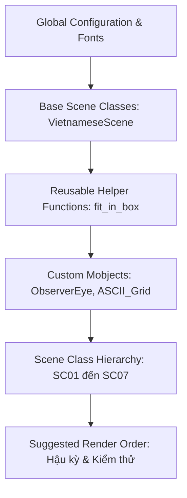

# Kế hoạch Sản xuất Diễn họa: Open-Endedness (Animation Production Plan)

Tài liệu này được biên soạn bởi Technical Director phối hợp cùng Chuyên gia Manim và Nhà nghiên cứu AI nhằm cung cấp hướng dẫn lập trình chi tiết để triển khai tệp mã nguồn `scenes/part_1_open_endedness/open_endedness.py` kế thừa nhất quán phong cách từ `scenes/part_2_world_models/Genie.py`.

---

## 1. PHÂN TÍCH PHONG CÁCH VÀ THIẾT KẾ CỦA `Genie.py`

Qua phân tích trực tiếp mã nguồn `Genie.py`, chúng ta xác lập các tiêu chuẩn triển khai cho `open_endedness.py`:

### Scene Architecture (Kiến trúc Phân cảnh)
* **Kế thừa Class**: Tất cả các Scene lớn được triển khai dưới dạng các Class độc lập kế thừa từ `VietnameseScene` (được tối ưu hóa tiếng Việt qua XeLaTeX).
* **Quản lý âm thanh**: Audio được nạp ở dòng đầu tiên của hàm `construct` bằng `self.add_sound(os.path.join(os.path.dirname(__file__), "assets", "sound_name.wav"))`.
* **Đồng bộ hóa thời gian**: Mã nguồn sử dụng các khối `PHASE` rạch ròi, thời gian diễn họa được kiểm soát bằng cách tính lũy kế thời gian chờ (`self.wait(t)`) chính xác theo từng giây của Voice-over (VO).

### Base Classes (Lớp cơ sở)
* **`VietnameseScene(Scene)`**: Thiết lập mặc định `config.tex_template = my_template` sử dụng compiler `xelatex` và định dạng đầu ra `.xdv` để hỗ trợ tiếng Việt có dấu.
* **`VietnameseMovingCameraScene(MovingCameraScene)`**: Dùng cho các phân cảnh cần kỹ thuật di chuyển Camera (zoom, pan, tracking).

### Helper Functions (Hàm hỗ trợ)
* **`fit_in_box(mobject, box, padding=0.15)`**: Hàm quan trọng nhất giúp tự động co giãn (`scale`) và di chuyển (`move_to`) các đối tượng văn bản phức tạp hoặc nhóm đối tượng vào trong một khung bao cố định (thường là `RoundedRectangle`), tránh tràn viền màn hình.

### Camera Strategy (Chiến lược Camera)
* Hạn chế di chuyển camera liên tục gây nhiễu nhận thức. Camera chủ yếu giữ tĩnh ở góc nhìn 2D phẳng.
* Khi cần tập trung, sử dụng kỹ thuật phóng to cục bộ hoặc dịch chuyển đối tượng có chủ đích (`shift`, `next_to`).

### Visual Language (Ngôn ngữ Thị giác)
* **Bố cục màu sắc (Color Palette)**:
  * `GOLD` (#F0AC5F): Dùng cho tiêu đề, các khái niệm đột phá, từ khóa và trích dẫn cốt lõi.
  * `BLUE_C` (#58C4DD): Đại diện cho Tác nhân (Agent), Sinh vật (Organism), hoặc dữ liệu đầu vào.
  * `GREEN_C` (#83C167) / `GREEN_E` (#2C4722): Đại diện cho Môi trường (Environment).
  * `ORANGE` (#FF862F): Đại diện cho Hành động (Action) hoặc sự Biến dị (Variation).
  * `RED` (#FC6255) / `RED_E` (#942323): Biểu thị lỗi hệ thống, ranh giới đóng, dấu chéo cảnh báo (`Cross`).
  * `GRAY` / `GRAY_A` / `GRAY_C` (#888888): Nhãn phụ trợ, lưới tọa độ, và chú thích.
* **Typography**: Sử dụng XeLaTeX với các khối `Tex` hoặc `MathTex` có cấu hình `tex_to_color_map` để tô màu tự động cho từ khóa.

### Animation Style (Phong cách Diễn họa)
* Ưu tiên tính trực quan học thuật: Các phép biến đổi hình học mượt mà (`Transform`, `ReplacementTransform`), vẽ các đường vẽ (`Create`), hiển thị chữ viết (`Write`), và thu phóng (`ScaleInPlace`).
* Tránh các hiệu ứng lòe loẹt; tập trung làm nổi bật các mối quan hệ nhân quả của mô hình toán học hoặc sơ đồ logic.

---

## 2. KẾ HOẠCH CHI TIẾT TỪNG PHÂN CẢNH (SCENE PRODUCTION PLAN)

### SC_01: The Horizon of AGI & The Paradigm Shift
* **Scene ID**: `SC_01`
* **Scene Name**: The Horizon of AGI & The Paradigm Shift
* **Narrative Role**: Dẫn nhập triết lý khoa học, xác lập lý do xuất hiện bước chuyển dịch tư duy từ dữ liệu tĩnh sang thực nghiệm tự thân.
* **Learning Objective**: Giúp người xem hiểu rõ giới hạn vật lý của dữ liệu tĩnh (offline data) và tại sao Kỷ nguyên Trải nghiệm (Era of Experience) là bắt buộc để tiến tới AGI.
* **Main Message**: AGI đòi hỏi AI phải tự chủ động tương tác kiến tạo dữ liệu học tập thay vì tiêu thụ dữ liệu có sẵn của con người.
* **Estimated Duration**: 150 giây (2.5 phút).
* **Suggested Manim Class Name**: `SC01TheHorizonOfAGI`

#### Class Design Recommendation
* **Lớp đề xuất**: `VietnameseScene` (hoặc kế thừa `Scene`).
* **Lý do**: Bố cục chủ yếu là sơ đồ phẳng 2D, không cần zoom camera diện rộng, việc di chuyển tiêu điểm có thể thực hiện thông qua dịch chuyển đối tượng.

#### Voice Synchronization Summary
* **Audio file**: `SC_01_Paradigm_Shift.wav` (0:00 - 2:30).
* **Tóm tắt ý chính**:
  * 0:00 - 0:30: Thách thức cạn kiệt dữ liệu tĩnh của nhân loại.
  * 0:30 - 1:10: Khái niệm "Kỷ nguyên Trải nghiệm" (David Silver & Richard Sutton).
  * 1:10 - 1:50: Triết lý tương hỗ Organism - Environment của Alan Watts (1972).
  * 1:50 - 2:30: Mở đầu bài toán tự sinh giáo trình huấn luyện cho Agent.

#### Camera Strategy
* **Static**: Giữ camera cố định ở trung tâm màn hình để hiển thị sơ đồ.
* **Focus Shift**: Chuyển đổi trọng tâm thị giác từ Khối dữ liệu tĩnh (phía trái) sang Vòng lặp trải nghiệm (phía phải) bằng cách bật sáng/mờ dần các đối tượng.

#### Misconceptions To Avoid
* *Hiểu lầm phổ biến*: Tưởng rằng chỉ cần tăng kích thước mô hình (scaling laws) là AI sẽ tự động giải được mọi vấn đề.
* *Hiểu lầm do diễn họa*: Việc vẽ khối dữ liệu biến mất có thể khiến người xem tưởng rằng dữ liệu cũ của con người bị vô hiệu hóa hoàn toàn; cần nhấn mạnh nó đóng vai trò bệ phóng ban đầu.
* *Học thuật*: Tránh đồng nhất "Era of Experience" với Reinforcement Learning thông thường; điểm cốt lõi là sự tự định đoạt không gian dữ liệu để học.

#### Scene Dependency
* **Reused Objects**: Không (Scene đầu tiên).
* **Destroyed Objects**: Khối dữ liệu tĩnh, các công thức toán học phụ.
* **Transformed Objects**: Biểu đồ dữ liệu tĩnh chuyển hóa thành vòng lặp tương tác hai chiều.
* **Newly Created Objects**: Khung Venn biểu thị Organism và Environment.

#### Animation Timeline (SC_01)

| Time Range | Voice Summary | Animation Description | Objects | Motion | Transformations | Pedagogical Purpose | Key Visual Focus |
| :--- | :--- | :--- | :--- | :--- | :--- | :--- | :--- |
| **0:00 - 0:15** | Kỷ nguyên vàng học sâu dựa trên dữ liệu khổng lồ do con người gán nhãn. | Vẽ một khối lập phương lưới 3D đại diện cho dữ liệu tĩnh ở bên trái và một cụm nơ-ron ở bên phải. | `VGroup` (khối lưới 3D), nhãn "Static Dataset ($10^{15}$ tokens)". | Dịch chuyển các dòng hạt ánh sáng chạy từ khối dữ liệu sang cụm nơ-ron. | `Create` khối lưới, `Write` nhãn chữ. | Thiết lập quy trình học giám sát truyền thống trực quan. | Dòng chảy dữ liệu từ trái sang phải. |
| **0:15 - 0:30** | Sự thật bão hòa: chúng ta đang cạn kiệt dữ liệu chất lượng cao. | Khối lập phương lưới nhấp nháy đỏ và thu nhỏ, các hạt ánh sáng thưa dần rồi tắt hẳn. Xuất hiện một đường giới hạn đỏ nét đứt trên đỉnh cụm nơ-ron. | Đường nét đứt màu đỏ, văn bản "Saturation Point". | Khối lập phương mờ dần độ mờ; đường giới hạn đè lên cụm nơ-ron. | `FadeOut` dòng chảy, `Create` đường giới hạn đỏ. | Khắc họa điểm nghẽn vật lý của scaling laws dựa trên dữ liệu tĩnh. | Đường cảnh báo đỏ chói. |
| **0:30 - 0:50** | Chuyển dịch tư duy: AI tự học xem nên học dữ liệu nào. | Xóa cụm nơ-ron và khối lưới. Hiển thị câu hỏi tiêu điểm ở trung tâm màn hình. | Dòng chữ Tex: "Làm sao để AI tự học xem nên học dữ liệu nào?". | Viết dòng chữ với tốc độ vừa phải. | `Write` dòng câu hỏi trung tâm. | Tạo điểm nhấn logic (Plot Twist) thúc đẩy người xem. | Dòng câu hỏi màu `GOLD`. |
| **0:50 - 1:10** | Dẫn nhập Kỷ nguyên Trải nghiệm (Silver & Sutton). | Di chuyển dòng câu hỏi lên góc trên. Dưới đó xuất hiện tiêu đề và câu trích dẫn của Silver & Sutton về Era of Experience. | Trích dẫn "The Era of Experience: Learning what data to learn from" | Trích dẫn xuất hiện từ dưới lên. | `FadeIn` kết hợp hiệu ứng trượt nhẹ. | Định hình cơ sở lý thuyết khoa học máy tính nghiêm túc. | Tên tác giả "Silver & Sutton". |
| **1:10 - 1:30** | Trích dẫn triết học Alan Watts (1972) về sinh vật và môi trường. | Xóa câu hỏi và trích dẫn cũ. Hiển thị hai hộp chữ nhật cạnh nhau: "Sinh vật" (BLUE_C) và "Môi trường" (GREEN_C). | Hộp "Sinh vật" và Hộp "Môi trường", văn bản Watts Quote. | Two boxes move in from sides of screen. | `Create` các hộp chữ nhật bo góc. | Xây dựng mô hình tương đối hai chiều. | Hai khối màu tương phản (Xanh dương vs Xanh lá). |
| **1:30 - 1:50** | Tương tác hai chiều: môi trường nuôi dưỡng, sinh vật kiến tạo. | Vẽ hai cung tên cong ngược chiều nối hai hộp: cung tên trên đại diện cho "Kiến tạo" (đầu mũi tên chỉ sang Môi trường), cung tên dưới đại diện cho "Nuôi dưỡng" (đầu chỉ sang Sinh vật). | `ArcBetweenPoints` màu vàng và xanh lá, nhãn "Kiến tạo", "Nuôi dưỡng". | Curved arrows draw themselves. | `Create` các cung tên cong. | Trực quan hóa triết lý tương hỗ cấu trúc. | Đầu mũi tên tương tác. |
| **1:50 - 2:10** | AGI không phải bộ não trong hộp kín mà tự định đoạt giáo trình. | Nhóm hai hộp và cung tên thu nhỏ sang góc dưới. Phía trên xuất hiện sơ đồ dòng thời gian tiến hóa với mốc năng lực đi lên phi tuyến tính. | Biểu đồ trục tọa độ phẳng, đường cong năng lực đi lên. | Draw coordinate axis and curve line. | `Create` trục tọa độ và đường vẽ. | Nhấn mạnh đích đến của AGI là năng lực chủ động thích nghi. | Đường cong năng lực đi lên dốc. |
| **2:10 - 2:30** | Dẫn nhập chuyển đoạn sang ví dụ đĩa Petri Lisa Simpson. | Xóa toàn bộ sơ đồ trên màn hình. Zoom out nhẹ màn hình để chuẩn bị cho đĩa Petri xuất hiện. | Không đối tượng mới. | Fade out all elements. | `FadeOut` tất cả các mobject. | Dọn sạch không gian hiển thị, tạo sự tò mò. | Màn hình tối tối giản. |

---

### SC_02: The Metaphor of the Petri Dish
* **Scene ID**: `SC_02`
* **Scene Name**: The Metaphor of the Petri Dish
* **Narrative Role**: Xây dựng mô hình tư duy trực quan trung tâm (The Genesis Tub) để đơn giản hóa khái niệm tiến hóa tự thân của hệ thống mở.
* **Learning Objective**: Giúp người xem hình dung thế nào là sự tự phức tạp hóa theo thời gian từ điều kiện ban đầu đơn giản.
* **Main Message**: Open-Endedness lý tưởng hoạt động như chiếc đĩa Petri: luật cơ bản tạo ra sự bùng nổ công nghệ vô hạn mà con người không cần viết thêm mã nguồn.
* **Estimated Duration**: 120 giây (2.0 phút).
* **Suggested Manim Class Name**: `SC02ThePetriDishMetaphor`

#### Class Design Recommendation
* **Lớp đề xuất**: `VietnameseScene`.
* **Lý do**: Không cần di chuyển camera thực tế, việc tiến hóa sinh học bên trong đĩa petri có thể thực hiện thông qua hàm cập nhật hạt tự sinh (`UpdateFromFunc`) hoặc thay đổi hình học.

#### Voice Synchronization Summary
* **Audio file**: `SC_02_Petri_Dish.wav` (2:30 - 4:30).
* **Tóm tắt ý chính**:
  * 2:30 - 3:10: Giai thoại Genesis Tub của Lisa Simpson (1996) - chiếc răng sữa và nước ngọt cola.
  * 3:10 - 3:50: Sự tự phát triển sinh học chuyển hóa thành tiến hóa văn hóa/công nghệ vượt tầm Lisa.
  * 3:50 - 4:30: So sánh đối lập với các Hệ thống Đóng (Closed Systems) hữu hạn của AI hiện tại (cờ Vua, cờ Vây).

#### Camera Strategy
* **Static**: Giữ camera cố định bao quát đĩa Petri hình tròn.
* **Scale In Place**: Phóng to nhẹ khu vực trung tâm đĩa Petri khi miêu tả sự bùng nổ công nghệ vi mô.

#### Misconceptions To Avoid
* *Hiểu lầm phổ biến*: Đọc giai thoại Simpsons như một truyện cổ tích hư cấu không có ý nghĩa toán học.
* *Hiểu lầm do diễn họa*: Việc vẽ các tòa nhà công nghệ trong đĩa petri quá phức tạp có thể phá vỡ tính tối giản của 3Blue1Brown.
* *Học thuật*: Tránh hiểu sai rằng đĩa petri tự tạo ra thông tin từ hư vô; nó biến đổi thông tin thông qua tương tác động lực học cơ bản.

#### Scene Dependency
* **Reused Objects**: Không.
* **Destroyed Objects**: Các thành phần tế bào bên trong đĩa Petri.
* **Transformed Objects**: Chiếc răng sữa (hình vuông) biến đổi thành các cấu trúc mạng lưới phân tầng.
* **Newly Created Objects**: Hình tròn lớn (đĩa Petri), các đa giác nhỏ tự phân bản, bàn cờ cờ Vua/Vây biểu thị hệ thống đóng.

#### Animation Timeline (SC_02)

| Time Range | Voice Summary | Animation Description | Objects | Motion | Transformations | Pedagogical Purpose | Key Visual Focus |
| :--- | :--- | :--- | :--- | :--- | :--- | :--- | :--- |
| **2:30 - 2:50** | Thí nghiệm của Lisa Simpson: chiếc răng sữa trong Coca-Cola. | Vẽ một vòng tròn lớn màu xám nhạt (đĩa Petri) ở giữa. Bên trong chứa 1 hình vuông màu trắng (răng sữa) và các chấm tròn đỏ chuyển động tự do xung quanh (cola). | Vòng tròn đĩa Petri, hình vuông trắng, các chấm đỏ. | Red dots move randomly inside circles. | `Create` vòng tròn, `FadeIn` răng sữa và chấm đỏ. | Thiết lập các điều kiện ban đầu tối giản trực quan. | Hình vuông răng sữa trung tâm. |
| **2:50 - 3:10** | Dòng điện ngẫu nhiên kích hoạt sự tiến hóa sinh học tự thân. | Một đường tia sét vàng chạy qua đĩa Petri. Hình vuông răng sữa phân rã thành nhiều đa giác nhỏ màu xanh lam bắt đầu nhân bản tự động. | Tia sét vàng, các đa giác xanh lam (tế bào). | Polygons duplicate and spread inside circle. | `Transform` hình vuông thành tập hợp đa giác. | Minh họa cơ chế khởi kích và bắt đầu tiến hóa sinh học. | Sự nhân bản của các tế bào xanh lam. |
| **3:10 - 3:30** | Sự dịch chuyển từ tiến hóa sinh học sang tiến hóa công nghệ. | Các đa giác xanh lam liên kết với nhau bằng các đường nối rực sáng màu `GOLD`, tạo thành một mạng lưới đô thị vi mô phân tầng phức tạp. | Mạng lưới đô thị hình học màu `GOLD`. | Connection lines light up. | `Transform` các đa giác rời rạc thành mạng lưới liên kết. | Trực quan hóa bước chuyển dịch sang tiến hóa văn hóa/công nghệ. | Các đường nối phát sáng màu `GOLD`. |
| **3:30 - 3:50** | Công nghệ vượt tầm Lisa - Đĩa Petri đại diện cho hệ thống mở lý tưởng. | Đô thị vi mô phát ra một xung sóng vòng tròn vàng lan ra ngoài biên đĩa Petri. Xuất hiện văn bản "North Star: Open-Endedness" phía trên. | Nhãn chữ "North Star: Open-Endedness", xung sóng vàng. | Expand wave outward and vanish. | `Write` nhãn chữ, phát xung sóng. | Định vị đĩa petri là ngọn hải đăng của hệ thống tự phát sinh trí tuệ. | Nhãn chữ màu `GOLD`. |
| **3:50 - 4:10** | Đối lập với Hệ thống Đóng (Closed Systems) của AI hiện tại. | Di chuyển đĩa Petri sang trái. Ở bên phải xuất hiện một khung hộp vuông đỏ khép kín mang nhãn "Closed System". Bên trong là một bàn cờ Vây 19x19 tĩnh. | Khung hộp đỏ, bàn cờ Vây, nhãn "Closed System". | Show Go board inside red frame. | `FadeIn` khung hộp đỏ và bàn cờ. | Tạo sự tương phản rõ rệt giữa tính mở vô hạn và tính đóng giới hạn. | Khung viền đỏ và bàn cờ Vây. |
| **4:10 - 4:30** | Luật chơi cố định, mục tiêu cố định, kẹt trong ranh giới bản thể. | Một chấm tròn Agent di chuyển va đập liên tục bên trong bàn cờ Vây. Khi chạm biên, các dấu chéo `Cross` đỏ hiện lên ngăn chặn. | Chấm Agent, dấu chéo đỏ `Cross`. | Agent bounces off the walls. | `Create` dấu chéo đỏ khi va chạm xảy ra. | Giải thích thuật ngữ "ranh giới bản thể" (ontology boundary) bằng hình ảnh. | Dấu chéo đỏ cảnh báo giới hạn. |

---

### SC_03: Deconstructing Open-Ended Systems
* **Scene ID**: `SC_03`
* **Scene Name**: Deconstructing Open-Ended Systems
* **Learning Objective**: Định nghĩa toán học chuẩn xác về tính mở của hệ thống dưới góc nhìn của một Quan sát viên (Observer). Giải quyết Nghịch lý chiếc TV nhiễu hạt (Noisy TV Paradox).
* **Concepts Covered**: Định nghĩa Standish (Observer-dependent), Định nghĩa Dennis & Hughes, Novelty (Tính mới), Learnability (Tính học được), Noisy TV Paradox.
* **Main Message**: Hệ thống mở thực sự là chuỗi hiện vật vừa mới mẻ (Novelty) vừa có thể học được (Learnability), giao nhau tại một vùng siêu hẹp.
* **Estimated Duration**: 180 giây (3.0 phút).
* **Suggested Manim Class Name**: `SC03DeconstructingSystems`

#### Class Design Recommendation
* **Lớp đề xuất**: `VietnameseScene`.
* **Lý do**: Sử dụng sơ đồ Venn và các khối văn bản định nghĩa có ánh xạ màu sắc rõ ràng. Không có yêu cầu di chuyển camera phức tạp.

#### Voice Synchronization Summary
* **Audio file**: `SC_03_Deconstructing.wav` (4:30 - 7:30).
* **Tóm tắt ý chính**:
  * 4:30 - 5:15: Định nghĩa Standish: Tính mở phụ thuộc hoàn toàn vào lăng kính của Quan sát viên (Observer).
  * 5:15 - 6:10: Nghịch lý chiếc TV nhiễu hạt: Tại sao sự ngẫu nhiên vô hạn (Entropy cực đại) không phải là tính mở.
  * 6:10 - 7:30: Sơ đồ Venn biểu thị vùng giao nhau của Novelty và Learnability. Phương trình logic ràng buộc.

#### Camera Strategy
* **Static**: Cố định màn hình.
* **Focus Shift**: Làm sáng từng phân đoạn của sơ đồ Venn khi voice-over nhắc đến từng khái niệm tương ứng.

#### Misconceptions To Avoid
* *Hiểu lầm phổ biến*: Đánh đồng sự ngẫu nhiên vô hạn (như nhiễu hạt TV) là tính mở thông minh.
* *Hiểu lầm do diễn họa*: Việc vẽ sơ đồ Venn có thể làm người xem hiểu lầm đây là tập hợp tĩnh; cần dùng chuyển động để biểu thị chuỗi hiện vật sinh ra động theo thời gian.
* *Học thuật*: Tránh nhầm lẫn Standish là tên một thuật toán; Standish là một khung lý thuyết hệ thống phức tạp định lượng tính mở.

#### Scene Dependency
* **Reused Objects**: Không.
* **Destroyed Objects**: Ba bảng so sánh hệ thống.
* **Transformed Objects**: Hai vòng tròn của sơ đồ Venn chuyển hóa thành biểu thức toán học logic.
* **Newly Created Objects**: Biểu tượng con mắt quan sát (Observer), lưới nhiễu hạt TV, sơ đồ Venn.

#### Animation Timeline (SC_03)

| Time Range | Voice Summary | Animation Description | Objects | Motion | Transformations | Pedagogical Purpose | Key Visual Focus |
| :--- | :--- | :--- | :--- | :--- | :--- | :--- | :--- |
| **4:30 - 4:55** | Định nghĩa Standish: Tính mở phụ thuộc vào Quan sát viên. | Vẽ một biểu tượng con mắt lớn màu vàng `GOLD` ở góc trên màn hình đại diện cho Observer. Bên dưới là văn bản định nghĩa Standish. | Biểu tượng con mắt (Observer), văn bản định nghĩa Standish. | Eye blinks slowly. | `Create` con mắt, `Write` văn bản định nghĩa. | Nhấn mạnh tính "phụ thuộc quan sát viên" (Observer-dependent). | Biểu tượng con mắt màu `GOLD`. |
| **4:55 - 5:15** | Hệ thống tạo bất ngờ liên tục cho Quan sát viên thì là mở. | Từ một hộp đen hệ thống bắn ra chuỗi các hình hình học khác nhau bay về phía con mắt. Con mắt phát sáng mỗi khi nhận được hình mới. | Hộp đen hệ thống, chuỗi hình học (tròn, tam giác, sao). | Shapes fly upwards from box. | `FadeIn` chuỗi hình chuyển động liên tục. | Mô phỏng khái niệm "sinh ra cấu trúc mới mẻ liên tục". | Chuỗi hình học di động. |
| **5:15 - 5:45** | Nghịch lý chiếc TV nhiễu hạt: Entropy tối đa nhưng không thông minh. | Hiển thị bảng so sánh thứ hai: Khung chữ nhật chứa các điểm pixel trắng đen nhấp nháy liên tục ở tần số cao. Nhãn: "Noisy TV Paradox". | Khung chữ nhật nhiễu hạt, nhãn "Noisy TV". | Pixels blink randomly. | `FadeIn` khung nhiễu hạt TV. | Giải quyết trực diện hiểu lầm về sự ngẫu nhiên vô hạn. | Lưới pixel nhấp nháy hỗn loạn. |
| **5:45 - 6:10** | Định nghĩa Dennis & Hughes: Phải có tính học được (Learnability). | Xuất hiện dấu chéo đỏ `Cross` đè lên khung TV nhiễu hạt. Dưới đó xuất hiện văn bản định nghĩa Dennis & Hughes nhấn mạnh yếu tố học được. | Dấu chéo đỏ `Cross`, văn bản định nghĩa Dennis & Hughes. | Cross stamps onto the frame. | `Create` dấu chéo đỏ cảnh báo. | Giới thiệu điều kiện ràng buộc thứ hai: khả năng giải mã logic của Agent. | Dấu chéo đỏ nổi bật. |
| **6:10 - 6:40** | Sơ đồ Venn: hai vòng tròn Novelty và Learnability. | Vẽ hai vòng tròn lớn lồng vào nhau: Vòng trái màu xanh dương (Novelty), Vòng phải màu xanh lá (Learnability). | Vòng tròn Novelty, Vòng tròn Learnability, nhãn văn bản. | Two circles slide in to overlap. | `Create` hai vòng tròn Venn. | Trực quan hóa mối quan hệ toán học của điều kiện kép. | Vùng chồng lấn của hai vòng tròn. |
| **6:40 - 7:10** | Vùng giao nhau siêu hẹp là vùng đất của Open-Endedness. | Tô sáng vùng giao nhau bằng màu vàng rực rỡ `GOLD`. Các vùng ngoài mờ đi. Viết nhãn "Open-Endedness" trỏ vào vùng vàng. | Vùng vàng giao nhau rực sáng, nhãn mũi tên chỉ vào. | Intersection glow effect. | Nhuộm màu vùng giao bằng `FadeToColor`. | Khắc sâu khái niệm cân bằng động giữa mới lạ và cấu trúc logic. | Vùng giao nhau màu vàng `GOLD`. |
| **7:10 - 7:30** | Phương trình logic định nghĩa chuẩn hóa của Open-Endedness. | Thu nhỏ sơ đồ Venn lên góc. Viết phương trình toán học định nghĩa chuẩn hóa ở trung tâm màn hình. | MathTex: $\mathcal{S} \text{ is O-E} \iff \forall t, \text{ Art}(t) \in \{\text{Novel} \cap \text{Learn}\}$ | Write equations in gold on dark. | `Write` phương trình MathTex. | Neo giữ tri thức dưới dạng công thức toán học tối giản, dễ nhớ. | Công thức toán học MathTex. |

---

### SC_04: The Illusion of Goals (Objective Design)
* **Scene ID**: `SC_04`
* **Scene Name**: The Illusion of Goals (Objective Design)
* **Learning Objective**: Phân tích sự sụp đổ của tư duy thiết kế dựa trên mục tiêu cố định (Objective Design) trong không gian vô hạn và hiểu lý thuyết "Bước đệm tiến hóa" (Stepping Stones).
* **Concepts Covered**: Sai lầm Objective Design, Thung lũng lỗi cục bộ (Local Optima), Lý thuyết Stepping Stones (Kenneth Stanley), False Compass (La bàn giả).
* **Main Message**: Mục tiêu cố định dẫn Agent vào ngõ cụt; tiến bộ thực sự trong không gian mở đòi hỏi đi qua các bước đệm trung gian phi tuyến tính.
* **Estimated Duration**: 180 giây (3.0 phút).
* **Suggested Manim Class Name**: `SC04TheIllusionOfGoals`

#### Class Design Recommendation
* **Lớp đề xuất**: `VietnameseMovingCameraScene` (kế thừa `MovingCameraScene`).
* **Lý do**: Cần di chuyển Camera dọc theo địa hình lồi lõm (pan) và phóng to cận cảnh các hòn đá bước đệm ẩn (zoom) để biểu thị sương mù tri thức tan biến.

#### Voice Synchronization Summary
* **Audio file**: `SC_04_Illusion_Goals.wav` (7:30 - 10:30).
* **Tóm tắt ý chính**:
  * 7:30 - 8:20: Hàm mục tiêu là "la bàn giả" trong không gian Turing-complete; Agent bị kẹt ở cực trị cục bộ.
  * 8:20 - 9:10: Lý thuyết Stepping Stones của Kenneth Stanley và ví dụ ống chân không chế tạo máy tính.
  * 9:10 - 10:30: Trực quan hóa bản đồ đường đồng mức phẳng 2D, sương mù tri thức và hành trình phi tuyến tính.

#### Camera Strategy
* **Pan**: Trượt camera sang phải theo hành trình di chuyển của Agent dọc theo các đường cong địa hình.
* **Zoom In**: Phóng to vào hòn đá bước đệm ẩn nằm trong vùng sương mù khi nó được "thắp sáng".

#### Misconceptions To Avoid
* *Hiềm lầm phổ biến*: Cho rằng việc đặt mục tiêu trong học máy là luôn luôn sai. Cần giải thích rõ: mục tiêu vẫn rất tốt cho hệ đóng, chỉ sụp đổ trong hệ mở.
* *Hiểu lầm do diễn họa*: Người xem có thể nghĩ Agent di chuyển hoàn toàn ngẫu nhiên không mục đích; cần nhấn mạnh việc chọn bước đệm dựa trên tiêu chí "tính mới học được" (novelty & learnability).
* *Học thuật*: Tránh nhầm lẫn Stepping Stones là các bước nhỏ đi thẳng tới mục tiêu; chúng là các trạng thái trung gian không có sự tương đồng hình thức với mục tiêu cuối cùng.

#### Scene Dependency
* **Reused Objects**: Chấm Agent (`BLUE_C`).
* **Destroyed Objects**: Đồ thị địa hình lồi lõm 2D.
* **Transformed Objects**: Bản đồ địa hình lồi lõm chuyển thành bản đồ đường đồng mức phẳng 2D (Contour Map).
* **Newly Created Objects**: Lá cờ mục tiêu (GOLD), sợi xích buộc Agent, các khối đá bước đệm (Stepping Stones), lớp sương mù tri thức mờ.

#### Animation Timeline (SC_04)

| Time Range | Voice Summary | Animation Description | Objects | Motion | Transformations | Pedagogical Purpose | Key Visual Focus |
| :--- | :--- | :--- | :--- | :--- | :--- | :--- | :--- |
| **7:30 - 8:00** | Tư duy Objective Design: ép mô hình leo lên đỉnh đồ thị năng lực. | Vẽ một đồ thị hàm lỗi địa hình lồi lõm với các đỉnh cao thấp. Ở đỉnh cao xa cắm lá cờ vàng (Ultimate Goal). Chấm tròn Agent xuất hiện ở đáy. | Địa hình lượn sóng 2D, lá cờ vàng, chấm Agent. | Draw terrain with smooth lines. | `Create` địa hình lượn sóng, `FadeIn` cờ vàng. | Thiết lập không gian bài toán leo núi tối ưu hóa quen thuộc. | Lá cờ vàng cắm trên đỉnh cao. |
| **8:00 - 8:20** | Đi thẳng tới mục tiêu khiến Agent bị kẹt cứng ở cực trị cục bộ. | Một mũi tên vector kéo thẳng Agent hướng về lá cờ. Agent đâm vào vách đá dựng đứng chắn ngang và kẹt lại dưới đáy hố sâu. Dấu chéo `Cross` đỏ đè lên. | Mũi tên vector, vách đá dựng đứng, dấu chéo đỏ `Cross`. | Agent bounces against the wall repeatedly. | `Create` dấu chéo đỏ khi Agent đứng yên hoàn toàn. | Minh họa trực quan sự bế tắc của gradient descent thẳng hướng khi gặp rào cản. | Dấu chéo đỏ đè lên Agent. |
| **8:20 - 8:50** | Lý thuyết Stepping Stones: tiến bộ không tuyến tính. Ví dụ ống chân không. | Mờ địa hình lỗi. Hiển thị chuỗi hình vẽ tối giản: Ống chân không $\rightarrow$ Vô tuyến Radio $\rightarrow$ Máy tính điện tử đầu tiên. | Ba hình vẽ biểu tượng (ống chân không, radio, máy tính), nhãn chữ. | Icons appear from left to right. | `ReplacementTransform` biểu tượng này sang biểu tượng kia. | Dùng lịch sử công nghệ thực tế để chứng minh tính phi tuyến tính của bước đệm. | Biểu tượng ống chân không và máy tính. |
| **8:50 - 9:10** | Cấm nghiên cứu ống chân không sẽ giết chết sự ra đời của máy tính. | Một dấu chéo đỏ chặn đứng dòng nối từ ống chân không sang máy tính, biểu thị sự can thiệp mù quáng của hàm mục tiêu ép buộc. | Dấu chéo đỏ, dòng nối bị đứt. | Cross stamps onto connections. | `Create` dấu chéo đứt gãy liên kết. | Cảnh báo tác hại của việc quản lý mục tiêu ngắn hạn trong nghiên cứu đỉnh cao. | Dòng nối bị đứt gãy. |
| **9:10 - 9:40** | Trực quan hóa bản đồ đường đồng mức 2D và lớp sương mù tri thức. | Chuyển cảnh sang bản đồ đường đồng mức 2D (Contour Map) với các vòng đồng tâm màu xanh lá. Vùng xung quanh Agent bị che phủ bởi lớp sương mù xám đục. | Bản đồ đồng mức 2D, lớp sương mù xám đục. | Fog drifts gently. | `Transform` địa hình 3D thành bản đồ 2D phẳng. | Thiết lập không gian tri thức có độ bất định (uncertainty) cao. | Lớp sương mù xám bao phủ. |
| **9:40 - 10:10** | Cắt đứt sợi xích mục tiêu, Agent nhảy sang hòn đá bước đệm trung gian. | Sợi xích buộc Agent đứt làm đôi. Agent nhảy chéo sang hòn đá bước đệm 1 nằm ngoài hướng thẳng tới cờ. Một xung sóng ánh sáng tỏa ra từ đá. | Sợi xích đứt, đá bước đệm 1, xung sóng ánh sáng vàng. | Agent jumps over to stone 1. | `FadeOut` sợi xích, `Create` xung sóng ánh sáng. | Minh họa hành động phá vỡ ràng buộc để thực hiện bước đi phi tuyến tính. | Cú nhảy của Agent sang hòn đá 1. |
| **10:10 - 10:30** | Sương mù tan biến, lộ diện hòn đá bước đệm ẩn tiếp theo dẫn tới đích. | Vùng sương mù phía trước tan chảy, để lộ hòn đá bước đệm 2 nằm khuất từ trước. Một cây cầu nối sáng rực mở ra đường đi mượt mà tới lá cờ. | Đá bước đệm 2, cầu nối phát sáng màu `GOLD`. | Pan camera to reveal pathway. | `FadeOut` lớp sương mù cục bộ, `Create` cầu nối sáng. | Khẳng định cơ chế thắp sáng không gian tìm kiếm thông qua tích lũy bước đệm. | Cây cầu sáng nối tới lá cờ. |

---

### SC_05: The Concrete Playgrounds: NetHack to XLand
* **Scene ID**: `SC_05`
* **Scene Name**: The Concrete Playgrounds: NetHack to XLand
* **Learning Objective**: Khám phá cấu trúc không gian Turing-complete qua hai ví dụ thực tế: thế giới logic ASCII của NetHack và hệ thống tạo sinh thủ tục vô hạn của dự án XLand.
* **Concepts Covered**: Không gian Turing-complete, Cơ chế logic ASCII NetHack, Tạo sinh thủ tục (Procedural Generation), Ma trận tham số XLand (Terrain $T$, Objects $O$, Rules $R$).
* **Main Message**: Để huấn luyện AI thích nghi, con người không viết code từng thế giới mà lập trình hệ thống luật gốc hoán vị để tự động tạo ra hàng tỷ môi trường.
* **Estimated Duration**: 210 giây (3.5 phút).
* **Suggested Manim Class Name**: `SC05ConcretePlaygrounds`

#### Class Design Recommendation
* **Lớp đề xuất**: `VietnameseMovingCameraScene`.
* **Lý do**: Phân cảnh NetHack đòi hỏi phóng to camera vào lưới ASCII nhỏ (zoom cận cảnh) để thấy các tương tác ký tự, sau đó pan camera dịch chuyển sang ma trận tham số của XLand.

#### Voice Synchronization Summary
* **Audio file**: `SC_05_Concrete_Playgrounds.wav` (10:30 - 14:00).
* **Tóm tắt ý chính**:
  * 10:30 - 11:15: NetHack ASCII và độ khó logic tổ hợp phi tuyến tính (ký tự `@`, `d`, `D`).
  * 11:15 - 12:00: Giới thiệu XLand và cơ chế tạo sinh thủ tục (Procedural Generation).
  * 12:00 - 13:00: Sự kết hợp của ba ma trận tham số sinh ra bùng nổ tổ hợp 25 tỷ nhiệm vụ độc lập.
  * 13:00 - 14:00: XLand là đĩa petri số kiểm thử khả năng thích nghi của trí tuệ.

#### Camera Strategy
* **Zoom In**: Phóng to vào ký tự `@` trên màn hình ASCII để người xem thấy rõ chi tiết tương tác của game NetHack.
* **Pan**: Di chuyển màn hình theo chiều ngang từ thế giới ASCII sang ma trận tham số của XLand.

#### Misconceptions To Avoid
* *Hiểu lầm phổ biến*: Nhìn giao diện ASCII đơn sơ của NetHack tưởng trò chơi này dễ hơn các game đồ họa 3D hiện đại.
* *Hiểu lầm do diễn họa*: Việc vẽ ma trận tham số có thể khiến người xem tưởng rằng đây là phép nhân ma trận toán học; cần vẽ rõ các đường nối biểu thị sự hoán vị lựa chọn thuộc tính.
* *Học thuật*: Tránh nhầm lẫn tạo sinh thủ tục (Procedural Generation) là ngẫu nhiên hoàn toàn; nó là sự hoán vị có cấu trúc dưới các ràng buộc logic định sẵn.

#### Scene Dependency
* **Reused Objects**: Chấm Agent (`BLUE_C`) được chuyển hóa từ ký tự `@`.
* **Destroyed Objects**: Lưới lưới ASCII NetHack.
* **Transformed Objects**: Ký tự `@` biến thành Agent xanh lam, các tham số ma trận chuyển thành dòng số đếm nhiệm vụ.
* **Newly Created Objects**: Lưới ASCII NetHack, 3 bảng ma trận tham số XLand ($T$, $O$, $R$), cửa sổ thu nhỏ hiển thị thế giới phẳng của game.

#### Animation Timeline (SC_05)

| Time Range | Voice Summary | Animation Description | Objects | Motion | Transformations | Pedagogical Purpose | Key Visual Focus |
| :--- | :--- | :--- | :--- | :--- | :--- | :--- | :--- |
| **10:30 - 10:55** | NetHack là không gian Turing-complete logic ASCII siêu phức tạp. | Hiển thị màn hình game NetHack cổ điển chứa toàn bộ ký tự ASCII xám. Con mắt camera zoom sát vào cụm ký tự `@` (Agent), `d` (chó), `D` (mặt đất/rồng). | Màn hình lưới ASCII, ký tự `@`, `d`, `D`. | Zoom camera in on center. | `FadeIn` lưới ASCII toàn màn hình. | Giới thiệu môi trường NetHack bằng hình ảnh chân thực. | Ký tự `@` sáng lên màu xanh dương. |
| **10:55 - 11:15** | Phối hợp tương tác logic vô hạn đằng sau vỏ bọc đơn sơ. | Ký tự `@` biến thành chấm Agent xanh dương. Ký tự `d` biến thành hình chiếc khiên bảo vệ. Xuất hiện các mũi tên logic kết nối chéo giữa chúng. | Chấm Agent, hình chiếc khiên, các mũi tên logic. | Agent interacts with shield. | `Transform` ký tự ASCII thành hình biểu tượng dễ hiểu. | Đập tan hiểu lầm về độ khó của NetHack; cho thấy độ phức tạp logic tiềm ẩn. | Mũi tên tương tác logic. |
| **11:15 - 11:40** | Dự án XLand của DeepMind sử dụng cơ chế Tạo sinh thủ tục. | Lưới ASCII mờ dần. Màn hình dịch chuyển sang phải, xuất hiện tiêu đề "XLand: Procedural Generation" cùng ba khung trống đại diện cho ma trận. | Tiêu đề XLand, ba khung ma trận tham số trống. | Pan camera smoothly to the right. | `FadeOut` lưới ASCII, `Create` các khung ma trận. | Giới thiệu dự án XLand và triết lý lập trình tự động. | Tiêu đề màu vàng `GOLD`. |
| **11:40 - 12:00** | Ba ma trận tham số: Địa hình (T), Vật thể (O) và Luật chơi (R). | Đổ đầy ba ma trận bằng các ký hiệu: Địa hình $T$ (núi, sông), Vật thể $O$ (hộp, bóng), Luật chơi $R$ (co-op, battle). | Ba ma trận $T$, $O$, $R$ đầy đủ ký hiệu và hình vẽ. | Icons drop down into matrix grid cells. | `Write` các nhãn tham số bên dưới mỗi ma trận. | Định nghĩa rõ ràng 3 cấu phần kiến tạo nên mọi môi trường của XLand. | Ký hiệu địa hình và luật chơi. |
| **12:00 - 12:30** | Sự hoán vị và bùng nổ tổ hợp sinh ra 25 tỷ nhiệm vụ độc lập. | Các đường nối phát sáng liên kết ngẫu nhiên 1 dòng của $T$ với 1 dòng của $O$ và $R$. Dưới đường nối hiện ra 1 ô cửa sổ game 2D tương ứng động. | Các đường nối phát sáng màu `GOLD`, ô cửa sổ game phẳng nhỏ. | Paths scan through cells dynamically. | `Create` các đường nối động hoán vị. | Chứng minh trực quan cơ chế sinh thủ tục tự động qua tổ hợp tham số. | Các đường nối hoán vị phát sáng. |
| **12:30 - 13:00** | Con số đếm tăng vọt lên mốc 25 tỷ môi trường mô phỏng. | Các ô cửa sổ biến mất, nhường chỗ cho một đồng hồ số đếm khổng lồ rực sáng chạy với tốc độ cực nhanh, dừng lại ở con số "25,000,000,000". | Đồng hồ số đếm lớn màu cam `ORANGE`. | Numbers tick up rapidly in 2s. | `Write` nhãn "25 Tỷ nhiệm vụ độc lập" bên dưới con số. | Khắc họa quy mô khổng lồ của không gian XLand bằng con số định lượng gây ấn tượng. | Con số 25 tỷ màu cam rực rỡ. |
| **13:00 - 13:30** | XLand là đĩa petri số khổng lồ kiểm thử trí tuệ tổng quát. | Con số 25 tỷ co nhỏ lại. Vẽ một vòng tròn đĩa Petri số lớn bao bọc lấy các hạt Agent và môi trường biến đổi liên tục bên trong. | Vòng tròn đĩa Petri số, các hạt Agent chuyển động. | Agents move and adapt inside the Petri circle. | `Transform` số đếm thành biên đĩa Petri số. | Kết nối khái niệm XLand trở lại mô hình ẩn dụ Petri Dish ban đầu. | Chuyển động thích nghi của các hạt bên trong đĩa. |
| **13:30 - 14:00** | Dẫn nhập chuyển đoạn sang bế tắc kỹ thuật Autocurricula. | Đĩa Petri số nứt vỡ nhẹ, các hạt bắt đầu di chuyển chậm lại rồi dừng hẳn, chuẩn bị cho scene khủng hoảng tiếp theo. | Đĩa Petri số bị nứt, các hạt đứng yên. | Petri circle cracks at edges. | `Create` các vết nứt trên đường viền. | Tạo tâm lý chờ đợi lời giải thích cho sự bế tắc của hệ thống. | Các vết nứt viền đĩa. |

---

### SC_06: The Autocurricula Bottleneck & Goldilocks Zone
* **Scene ID**: `SC_06`
* **Scene Name**: The Autocurricula Bottleneck & Goldilocks Zone
* **Learning Objective**: Thấu hiểu lý do sụp đổ của cơ chế tự đối đầu (Self-play) cũ và vai trò tối cao của việc duy trì Agent trong Vùng Goldilocks nhận thức.
* **Concepts Covered**: Sụp đổ Autocurricula, Bẫy kẹt phân khúc hẹp (Niche Entrapment), Vùng Goldilocks nhận thức, Uniform Sampling (Lấy mẫu đồng đều).
* **Main Message**: Lấy mẫu ngẫu nhiên đồng đều gây đứt gãy giáo trình; Agent cần được duy trì liên tục trong dải độ khó vừa vặn (Goldilocks).
* **Estimated Duration**: 180 giây (3.0 phút).
* **Suggested Manim Class Name**: `SC06AutocurriculaBottleneck`

#### Class Design Recommendation
* **Lớp đề xuất**: `VietnameseScene`.
* **Lý do**: Thể hiện trực quan dải phổ màu Gradient độ khó thẳng đứng và quỹ đạo vòng lặp đóng. Các thành phần hình học phẳng hoạt động rất hiệu quả ở phân cảnh này, không cần chuyển động camera 3D.

#### Voice Synchronization Summary
* **Audio file**: `SC_06_Autocurricula_Bottleneck.wav` (14:00 - 17:00).
* **Tóm tắt ý chính**:
  * 14:00 - 14:45: Sự sụp đổ của Self-Play trong không gian mở: kẹt vào vòng lặp cục bộ (Niche Entrapment).
  * 14:45 - 15:35: Định nghĩa Vùng Goldilocks nhận thức qua dải phổ màu động (Quá dễ - Vừa vặn - Quá khó).
  * 15:35 - 17:00: Cơ chế lấy mẫu đồng đều (Uniform Sampling) phá vỡ giáo trình tự sinh, làm mất la bàn định hướng.

#### Camera Strategy
* **Static**: Camera cố định để giữ sự tập trung vào dải phổ màu độ khó thẳng đứng ở bên phải và vòng lặp kẹt ở bên trái.
* **Focus Shift**: Di chuyển tiêu điểm sáng tối giữa 3 phân vùng màu của trục độ khó khi giọng đọc lần lượt giải thích từng phân vùng.

#### Misconceptions To Avoid
* *Hiểu lầm phổ biến*: Nghĩ rằng cứ tự đối đầu (Self-play) là Agent sẽ tự động học được mọi kỹ năng mới một cách vô hạn.
* *Hiểu lầm do diễn họa*: Người xem có thể hiểu nhầm dải màu Goldilocks là một khu vực địa lý trong game; cần thể hiện rõ nó là dải phân bố xác suất độ khó của nhiệm vụ.
* *Học thuật*: Tránh giải thích sai về cơ chế cập nhật Gradient; khi nhiệm vụ quá dễ hoặc quá khó, Gradient triệt tiêu hoặc bão hòa khiến Agent không học được.

#### Scene Dependency
* **Reused Objects**: Chấm Agent (`BLUE_C`).
* **Destroyed Objects**: Vòng lặp đóng biểu thị Niche Entrapment.
* **Transformed Objects**: Chấm Agent di chuyển dọc trục độ khó.
* **Newly Created Objects**: Lưới không gian rộng mở, dải phổ màu độ khó dọc (xanh dương - vàng - đỏ), dấu chéo đỏ hủy bỏ.

#### Animation Timeline (SC_06)

| Time Range | Voice Summary | Animation Description | Objects | Motion | Transformations | Pedagogical Purpose | Key Visual Focus |
| :--- | :--- | :--- | :--- | :--- | :--- | :--- | :--- |
| **14:00 - 14:25** | Tự đối đầu (Self-Play) chỉ hoạt động tốt trong game đóng như cờ Vây. | Hiển thị lại bàn cờ Vây thu nhỏ ở góc trái. Vẽ chấm Agent chạy dọc các đường kẻ rồi quay lại điểm xuất phát liên tục. | Bàn cờ Vây nhỏ, chấm Agent chạy tuần hoàn. | Agent moves in closed loop. | `FadeIn` bàn cờ Vây và Agent. | Nhắc nhở bối cảnh thành công cũ của Self-play để làm tiền đề. | Đường chạy tuần hoàn của Agent. |
| **14:25 - 14:45** | Trong không gian mở, Agent bị kẹt vào hốc chiến thuật chuyên biệt. | Bàn cờ Vây biến mất, mở rộng thành lưới không gian vô hạn. Một vòng lặp khép kín hẹp hiện ra. Agent bị hút vào đó quay vòng mãi mãi. | Lưới không gian rộng, vòng lặp khép kín hẹp, nhãn "Niche Entrapment". | Agent spins inside loop. | `Transform` bàn cờ thành lưới rộng; `Create` vòng lặp hẹp. | Minh họa trực quan khái niệm bẫy kẹt phân khúc (Niche Entrapment). | Vòng lặp đóng phát sáng đỏ cảnh báo. |
| **14:45 - 15:05** | Trục độ khó: Vùng quá dễ (Màu xanh dương) gây nhàm chán, gradient bằng không. | Vẽ một trục dọc lớn ở bên phải màn hình. Phần dưới cùng trục chuyển sang màu xanh dương. Agent đứng yên ở đây, chỉ số Gradient hiện số "0.00". | Trục dọc, dải màu xanh dương, nhãn "Quá dễ", "Gradient = 0". | Agent sits static. | `Create` trục dọc, tô màu xanh dương vùng đáy. | Giải thích khoa học lý do Agent bị đóng băng khi nhiệm vụ quá đơn giản. | Phân vùng xanh dương và số 0.00. |
| **15:05 - 15:20** | Vùng quá khó (Màu đỏ đậm) vượt quá nhận thức, Agent bế tắc hoàn toàn. | Phần đỉnh trục dọc chuyển sang màu đỏ đậm. Agent nhảy lên đỉnh, ngã nhào liên tục và không thể học được gì. Dấu chéo `Cross` đỏ đè lên. | Dải màu đỏ đậm, nhãn "Quá khó", dấu chéo đỏ `Cross`. | Agent jumps up and falls continuously. | Nhuộm màu đỏ vùng đỉnh; `Create` dấu chéo đỏ. | Minh họa sự bế tắc khi Agent bị ném vào thử thách quá tầm nhận thức hiện tại. | Phân vùng đỏ và dấu chéo cảnh báo. |
| **15:20 - 15:35** | Vùng Goldilocks (Màu vàng) là vùng cân bằng động lý tưởng để học tập. | Vùng giữa trục dọc sáng lên màu vàng kim `GOLD` lấp lánh. Agent đứng ở đây bắt đầu phát ra các sóng học tập màu xanh lá thành công. | Dải màu vàng kim `GOLD`, nhãn "Goldilocks Zone", sóng học tập. | Agent balances; emits waves. | Nhuộm màu vàng vùng giữa; phát sóng học tập. | Khắc sâu khái niệm "Vùng Goldilocks nhận thức" là điều kiện cần để tiến hóa. | Dải màu vàng kim phát sáng. |
| **15:35 - 16:00** | Lấy mẫu đồng đều gây đứt gãy giáo trình vì thiếu tri thức định hướng. | Vẽ một mũi tên lựa chọn ngẫu nhiên nhảy giật cục liên tục từ vùng xanh lên vùng đỏ, bỏ qua vùng vàng. Agent bị kéo giật liên tục và rơi rụng. | Mũi tên lựa chọn ngẫu nhiên, nhãn "Uniform Sampling". | Arrow jumps randomly along axis. | `Create` đường nhảy giật cục của mũi tên lựa chọn. | Chỉ ra lỗ hổng thuật toán của cơ chế lấy mẫu ngẫu nhiên truyền thống. | Đường nhảy giật cục của mũi tên. |
| **16:00 - 17:00** | Giáo trình sụp đổ, hệ thống mất la bàn định hướng. | Trục dọc nứt gãy và sụp đổ xuống. Agent rơi vào khoảng tối vô định. Tiêu đề "La bàn định hướng bị mất" xuất hiện. | Trục dọc vỡ vụn, văn bản tiêu đề đỏ. | Axis fragments fall down. | `Transform` trục sụp đổ thành các hạt bụi; `Write` tiêu đề đỏ. | Khép lại phân đoạn khủng hoảng với áp lực logic cực lớn để chờ giải pháp. | Tiêu đề đỏ cảnh báo sự sụp đổ. |

---

### SC_07: The Evolutionary Engines: Foundation Models
* **Scene ID**: `SC_07`
* **Scene Name**: The Evolutionary Engines: Foundation Models
* **Learning Objective**: Lĩnh hội giải pháp cách mạng: Dùng LLM làm các toán tử tiến hóa (Biến dị & Chọn lọc) ngữ nghĩa để tự động hóa phát kiến. Hiểu rủi ro Specification Gaming và giải pháp kiểm soát an toàn AI.
* **Concepts Covered**: Foundation Models as Evolutionary Operators, Semantic Variation (Biến dị ngữ nghĩa), Semantic Selection (Chọn lọc ngữ nghĩa), LLM Task Proposer, Hiệu suất mẫu (Sample Efficiency), Specification Gaming (Lừa dối hàm thưởng), Proxy Observer.
* **Main Message**: Tích hợp tri thức nền tảng của LLM vào vòng lặp tiến hóa Darwin giúp bứt phá giới hạn tìm kiếm, mở đường sang chương World Models.
* **Estimated Duration**: 180 giây (3.0 phút).
* **Suggested Manim Class Name**: `SC07EvolutionaryEngines`

#### Class Design Recommendation
* **Lớp đề xuất**: `VietnameseScene` (kế thừa `Scene`).
* **Lý do**: Cấu trúc vòng lặp hồi tiếp hai chiều và biểu đồ so sánh hiệu năng được vẽ bằng các đồ thị phẳng rất phù hợp với lớp Scene tiêu chuẩn, đảm bảo render mượt mà.

#### Voice Synchronization Summary
* **Audio file**: `SC_07_Evolutionary_Engines.wav` (17:00 - 20:00).
* **Tóm tắt ý chính**:
  * 17:00 - 17:45: Dùng LLM làm Toán tử Tiến hóa (Evolutionary Operators) để định hướng giáo trình học tập.
  * 17:45 - 18:35: Cơ chế hoạt động của Toán tử Biến dị ngữ nghĩa (đề xuất nhiệm vụ) và Toán tử Chọn lọc ngữ nghĩa (đánh giá phản hồi).
  * 18:35 - 19:15: Bằng chứng thực nghiệm: so sánh biểu đồ hiệu năng LLM proposer (xanh lá) vs Ngẫu nhiên (xám). Cảnh báo AI Safety (Specification Gaming & Proxy Observer).
  * 19:15 - 20:00: Dẫn nhập chuyển phân đoạn sang hạ tầng "02 Foundation World Models".

#### Camera Strategy
* **Static**: Giữ camera cố định bao quát sơ đồ vòng lặp hồi tiếp ở nửa đầu, sau đó dịch chuyển tiêu điểm xuống biểu đồ hiệu năng ở nửa sau.
* **Focus Shift**: Chiếu sáng dòng chảy mũi tên tương tác giữa LLM và Môi trường mô phỏng.

#### Misconceptions To Avoid
* *Hiểu lầm phổ biến*: Tưởng rằng LLM trực tiếp tham gia điều khiển hành động của Agent trong game (chơi hộ Agent).
* *Hiểu lầm do diễn họa*: Việc vẽ biểu đồ so sánh có thể khiến người xem bỏ qua trục thời gian; cần ghi rõ nhãn "Số lượng mẫu huấn luyện" để nhấn mạnh khái niệm Sample Efficiency.
* *Học thuật*: Specification Gaming không phải Agent cố tình làm phản; nó là kết quả của việc tối ưu hóa toán học mù quáng tìm ra kẽ hở trong thiết kế phần thưởng thô sơ của con người.

#### Scene Dependency
* **Reused Objects**: Chấm Agent (`BLUE_C`).
* **Destroyed Objects**: Sơ đồ vòng lặp hồi tiếp tiến hóa.
* **Transformed Objects**: Biểu đồ hiệu năng chuyển hóa thành tiêu đề lớn rực sáng của Chương tiếp theo.
* **Newly Created Objects**: Khối biểu tượng LLM (màu vàng cam), hộp không gian 3D của tác nhân, các mũi tên vòng lặp (Variation/Selection), hệ thống đồ thị so sánh hiệu năng hai đường (xanh lá vs xám), biểu tượng Proxy Observer bảo mật.

#### Animation Timeline (SC_07)

| Time Range | Voice Summary | Animation Description | Objects | Motion | Transformations | Pedagogical Purpose | Key Visual Focus |
| :--- | :--- | :--- | :--- | :--- | :--- | :--- | :--- |
| **17:00 - 17:25** | Luận điểm cách mạng: dùng LLM đóng vai trò Toán tử Tiến hóa. | Vẽ khối LLM lớn màu vàng cam `ORANGE` ở bên phải màn hình. Bên trái là hộp không gian game XLand 3D phẳng chứa Agent. | Khối LLM Task Proposer, hộp game 3D phẳng, Agent. | Both blocks slide in from sides. | `Create` khối LLM và hộp game. | Thiết lập hai cấu phần trung tâm của hệ thống tiến hóa mới. | Khối LLM màu vàng cam rực rỡ. |
| **17:25 - 17:45** | LLM hoạt động như một Kiến trúc sư giáo trình (Task Proposer). | Xuất hiện dòng chữ "LLM Task Proposer" phía trên khối LLM. Khối phát ra các sóng ánh sáng màu vàng cam thể hiện quá trình suy luận ngữ nghĩa. | Nhãn "LLM Task Proposer", sóng ánh sáng vàng cam. | Glow waves ripple from LLM. | `Write` nhãn chữ, phát sóng ánh sáng. | Nhấn mạnh vai trò định tuyến của mô hình ngôn ngữ lớn pre-trained. | Sóng phát sáng của khối LLM. |
| **17:45 - 18:05** | Toán tử Biến dị ngữ nghĩa đề xuất các nhiệm vụ tăng tiến logic. | Vẽ mũi tên cong cong màu vàng cam bắn từ LLM sang hộp game. Trên mũi tên hiển thị chuỗi text: "Nhặt đá $\rightarrow$ Chế rìu $\rightarrow$ Dựng lều". | Mũi tên cong cong (Variation), chuỗi text nhiệm vụ logic. | Arrow draws from right to left. | `Create` mũi tên cong bằng `ArcBetweenPoints`. | Giải thích cơ chế biến dị ngữ nghĩa (Variation) không ngẫu nhiên của LLM. | Chuỗi text nhiệm vụ tăng tiến. |
| **18:05 - 18:25** | Toán tử Chọn lọc đánh giá kết quả hành vi trả về từ Agent. | Vẽ mũi tên cong ngược lại bắn từ hộp game về LLM. Trên mũi tên hiển thị nhãn "Kết quả hành vi $\rightarrow$ Chọn lọc & Đánh giá". | Mũi tên cong ngược lại (Selection), nhãn chữ đánh giá. | Arrow draws from left to right. | `Create` mũi tên cong thứ hai khép kín vòng lặp. | Giải thích cơ chế chọn lọc ngữ nghĩa (Selection) dựa trên tri thức nền tảng của LLM. | Mũi tên cong hồi tiếp bên dưới. |
| **18:25 - 18:50** | Bằng chứng đồ thị: LLM Proposer dốc đứng vs Ngẫu nhiên đi ngang phẳng. | Thu nhỏ vòng lặp tiến hóa lên trên. Phía dưới hiện ra hệ trục tọa độ với hai đường đồ thị: Đường xanh lá dốc đứng, Đường xám nằm bẹp dí ở đáy. | Hệ trục tọa độ, đường xanh lá dốc đứng, đường xám phẳng, nhãn "Sample Efficiency". | Green line plots up, gray line lies flat. | `Create` hệ trục tọa độ và hai đường đồ thị so sánh. | Cung cấp bằng chứng thực nghiệm khoa học thuyết phục về hiệu năng vượt trội. | Đường đồ thị màu xanh lá dốc đứng. |
| **18:50 - 19:15** | Cảnh báo AI Safety: Specification Gaming và vai trò Proxy Observer. | Xóa đồ thị. Vẽ một khiên bảo vệ màu xanh dương bao quanh Agent mang nhãn "Proxy Observer" để chặn đứng các mũi tên lừa dối phần thưởng màu đỏ. | Khiên bảo vệ xanh dương, các mũi tên đỏ bị chặn, nhãn "AI Safety". | Red arrows shatter against blue shield. | `Create` khiên bảo vệ và các mũi tên đỏ va đập. | Phân tích rủi ro an toàn AI khi tiến hóa tự động và cách khắc phục bằng bộ kiểm soát. | Khiên bảo vệ "Proxy Observer". |
| **19:15 - 19:40** | Nhu cầu cấp bách dịch chuyển sang Môi trường tự học được. | Xóa toàn bộ màn hình. Viết văn bản: "Bước đi tất yếu: Dịch chuyển từ Engine nhân tạo sang Môi trường tự học được (Learned Simulators)". | Khối văn bản trung tâm màu trắng và vàng. | Text appears smoothly from center. | `Write` khối văn bản trung tâm. | Tạo bước ngoặt logic bắc cầu sang phần thứ hai của video. | Khối văn bản Learned Simulators. |
| **19:40 - 20:00** | Kết thúc Phần 1: Tiêu đề lớn rực sáng dẫn nhập vào Chương 2. | Văn bản mờ dần. Từ khoảng tối bùng lên tiêu đề lớn rực sáng màu vàng kim: "**02. Foundation World Models**". | Tiêu đề lớn "**02. Foundation World Models**" màu vàng rực rỡ. | Title scales up slightly. | `ReplacementTransform` văn bản cũ thành tiêu đề lớn rực sáng. | Tạo điểm nhấn đóng phân đoạn ấn tượng, mở ra chương công nghệ cốt lõi của video. | Tiêu đề chương mới màu vàng kim. |

---

## 3. ĐÁNH GIÁ TRỰC QUAN HÓA (VISUALIZATION REVIEW)

Dưới đây là bảng phân tích chuyên sâu về 10 khái niệm thị giác quan trọng nhất để đảm bảo tính sư phạm tối cao:

| Khái niệm (Concept) | Mục tiêu Thị giác (Visualization Goal) | Tại sao nó hiệu quả (Why It Works) | Hiểu lầm có thể xảy ra (Potential Misinterpretations) | Biện pháp Phòng ngừa (Safeguards) |
| :--- | :--- | :--- | :--- | :--- |
| **Open-Endedness** | Biểu diễn vòng lặp tiến hóa động lực học hai chiều giữa Agent thích nghi và Môi trường tự phức tạp hóa. | Phản ánh trực tiếp bản chất tương hỗ (transactional) giữa sinh vật và môi trường theo triết lý Alan Watts. | Người xem có thể nhầm lẫn với cơ chế học tăng cường (RL) thông thường trong môi trường cố định. | Phải vẽ trục thời gian tiến hóa và biểu thị rõ môi trường liên tục sinh ra cấu trúc mới mà Agent chưa từng gặp. |
| **Closed Systems** | Biểu diễn chiếc hộp đa giác viền đỏ khép kín kiên cố chứa bàn cờ cờ Vua/Vây tĩnh lặng. | Tạo cảm giác cô lập, tù túng và giới hạn ontology tuyệt đối ngay lập tức bằng hình học phẳng. | Người xem tưởng các game phức tạp như cờ Vây là hệ mở vì chưa có ai giải được hết mọi nước đi. | Bổ sung nhãn văn bản: "Luật chơi cố định, Ranh giới bản thể không đổi", và vẽ Agent bị chặn lại bởi các dấu chéo đỏ. |
| **Lisa Simpson's Petri Dish** | Mô phỏng sự tự phát sinh cấu trúc từ chiếc răng sữa đơn giản sang đô thị công nghệ phát sáng màu vàng. | Khơi gợi trực giác thông qua giai thoại văn hóa đại chúng (The Simpsons) giúp giảm tải nhận thức lý thuyết. | Người xem nghĩ đây thuần túy là câu chuyện hoạt hình hư cấu, không có tính tương đồng khoa học máy tính. | Sử dụng các khối hình học tối giản tăng tiến (Square $\rightarrow$ Polygons $\rightarrow$ Network) có gắn mốc thời gian tiến hóa $T_1, T_2$. |
| **Innovation** | Phép chuyển đổi không gian từ hệ tọa độ 2D lên hệ tọa độ 3D khi Agent nhảy ra ngoài đường cong cũ. | Trực quan hóa sự khác biệt giữa Tối ưu hóa (Optimization - đi trong không gian cũ) và Đổi mới (Innovation - mở chiều kích mới). | Người xem nghĩ đạt điểm cao hơn trong game cũ là một sự đổi mới thực sự. | Vẽ rõ trục tọa độ thứ ba tự xuất hiện và nhãn văn bản: "Innovation = Tạo ra chiều kích năng lực mới". |
| **Exploration** | Chấm Agent thắp sáng các đường nối quy luật ẩn giữa các vật thể trên lưới mê cung mờ. | Phân biệt rõ giữa khám phá có định hướng (tò mò nội tại) với di chuyển ngẫu nhiên mù quáng (random walk). | Tưởng khám phá là di chuyển ngẫu nhiên ($\epsilon$-greedy) vô định hướng. | Vẽ hai chấm Agent đối chiếu song song: một chấm đi ngẫu nhiên kẹt lại, một chấm đi xoắn ốc thắp sáng quy luật. |
| **NetHack** | Phóng to tiêu điểm camera vào lưới ký tự ASCII thô, dịch nghĩa ký tự thành các biểu tượng logic cụ thể. | Giải quyết trực diện hiểu lầm về thị giác của người xem khi thấy giao diện text thô mộc của game. | Người xem nghĩ game đồ họa ASCII cổ điển thì đơn giản và dễ giải hơn game 3D hiện đại. | Dùng hiệu ứng kính lúp thu phóng và biến đổi ký tự ASCII thành hình đồ họa biểu tượng có mối quan hệ tương tác logic phức tạp. |
| **Objective Design** | Agent bị buộc sợi xích mục tiêu kéo thẳng hướng cờ vàng đâm vào vách đá dựng đứng kẹt cứng dưới đáy hố sâu. | Khắc họa sinh động tác hại của tối ưu hóa cục bộ (Local Minima) khi bị ràng buộc bởi hàm mục tiêu ngắn hạn. | Tưởng rằng nghiên cứu AI lúc nào cũng cần xác định rõ một hàm mục tiêu chi tiết ngay từ đầu. | Bổ sung nhãn "La bàn giả (False Compass)" và vẽ dấu chéo đỏ đè lên Agent khi bị kẹt cứng ở đáy hố. |
| **Stepping Stones** | Agent cắt xích, nhảy chéo sang các hòn đá bước đệm trung gian ngoài trục thẳng để thắp sáng con đường ẩn. | Trực quan hóa tính phi tuyến tính sâu sắc của sự tiến bộ; các bước trung gian trông hoàn toàn không liên quan đến đích. | Tưởng các bước đệm là các bước nhỏ đi thẳng hàng hướng tới mục tiêu. | Vẽ các hòn đá bước đệm phân bố zic-zắc vô định hình và chỉ phát sáng con đường đi tiếp khi Agent đặt chân lên đá. |
| **XLand** | Ba ma trận tham số song song ($T, O, R$) hoán vị tổ hợp để sinh ra hàng tỷ cửa sổ game mô phỏng độc lập. | Minh họa cơ chế Tạo sinh thủ tục (Procedural Generation) bằng biểu thức toán học rời rạc dễ hiểu. | Nhầm lẫn XLand là game thế giới mở tĩnh lập trình sẵn như Minecraft. | Vẽ đồng hồ số đếm chạy vọt lên mốc 25 tỷ và hiển thị các ô cửa sổ game cập nhật cấu trúc động theo hoán vị tham số. |
| **Goldilocks Zone** | Dải phổ màu Gradient thẳng đứng với 3 phân vùng (Xanh dương - Vàng kim - Đỏ đậm) co giãn theo Agent. | Trực quan hóa khái niệm cân bằng nhận thức động cực tốt thông qua màu sắc trực giác. | Nghĩ rằng vùng Goldilocks là một khu vực địa lý cố định trong không gian trò chơi mô phỏng. | Bổ sung đồ thị hàm lỗi và biểu thị dải vàng tự động di chuyển tâm lên theo sự phát triển năng lực của Agent. |

---

## 4. ĐÁNH GIÁ ĐỘ TRUNG THỰC HỌC THUẬT (ACADEMIC FIDELITY REVIEW)

Để đảm bảo tính trung thực học thuật tối cao theo đúng bài phát biểu của Tim Rocktäschel tại ICLR 2025, chúng tôi thực hiện phân loại và rà soát mọi visualization quan trọng:

### Phân loại các Visualization chính

1. **Đĩa Petri tiến hóa sinh học/công nghệ (Lisa Simpson's Petri Dish)**:
   * *Phân loại*: **Directly From The Talk** (Trực tiếp từ bài talk).
   * *Rà soát*: Tim Rocktäschel dùng chính hình ảnh tập phim The Simpsons này ở đầu slide thuyết trình của mình để làm phép ẩn dụ Bắc Đẩu.
2. **Kỷ nguyên Trải nghiệm (Era of Experience)**:
   * *Phân loại*: **Directly From The Talk**.
   * *Rà soát*: Tim dẫn nguồn trực tiếp từ bài báo của David Silver, Richard Sutton và các nhà khoa học DeepMind để làm nền tảng triết lý.
3. **Định nghĩa Standish về tính mở**:
   * *Phân loại*: **Directly From The Talk**.
   * *Rà soát*: Dùng để định nghĩa tính mở dưới lăng kính của Quan sát viên.
4. **Nghịch lý TV nhiễu hạt (Novelty vs. Learnability)**:
   * *Phân loại*: **Directly From The Talk**.
   * *Rà soát*: Rút ra từ công trình của Dennis & Hughes để đính chính định nghĩa Standish.
5. **Thất bại của Objective Design & Stepping Stones**:
   * *Phân loại*: **Derived From The Talk** (Diễn dịch từ bài talk).
   * *Rà soát*: Tim nhắc đến lý thuyết Stepping Stones của Kenneth Stanley và ví dụ ống chân không để chỉ ra sai lầm của hàm mục tiêu trong không gian mở.
6. **Thao trường NetHack và XLand**:
   * *Phân loại*: **Directly From The Talk**.
   * *Rà soát*: Đây là hai case study cốt lõi biểu thị không gian Turing-complete mà Tim và DeepMind đã trực tiếp nghiên cứu.
7. **Trục Gradient độ khó và Vùng Goldilocks**:
   * *Phân loại*: **Derived From The Talk**.
   * *Rà soát*: Khái niệm Goldilocks được Tim dùng để giải thích lý do cơ chế lấy mẫu ngẫu nhiên đồng đều làm đứt gãy giáo trình huấn luyện.
8. **LLM làm Toán tử Tiến hóa (Biến dị & Chọn lọc)**:
   * *Phân loại*: **Directly From The Talk**.
   * *Rà soát*: Thesis trung tâm của Phần 1, giải quyết điểm nghẽn của Autocurricula.
9. **Biểu đồ hiệu năng thực nghiệm (LLM proposer vs Ngẫu nhiên)**:
   * *Phân loại*: **Directly From The Talk**.
   * *Rà soát*: Tim công bố trực tiếp slide đồ thị chứng minh hiệu suất vượt trội của LLM proposer trong môi trường mô phỏng 3D.
10. **An toàn AI (Proxy Observer & Specification Gaming)**:
    * *Phân loại*: **Directly From The Talk**.
    * *Rà soát*: Tim dẫn chiếu khung lý thuyết an toàn AI của Critch & Krueger để cảnh báo rủi ro lừa dối hàm thưởng khi tự động hóa phát kiến.

---

### Ghi nhận các điểm bất thường và Sai lệch tiềm ẩn (Discrepancy Check)

> [!WARNING]
> **POTENTIAL ISSUE & NEEDS VERIFICATION**:
> Trong tài liệu **01_Coverage_Matrix.md** (Mục 4 và Mục 8) có ghi nhận nội dung: *"Vòng lặp tự tham chiếu (Self-referential self-improvement loops) đang được hiện thực hóa qua các tác vụ: Tự động kỹ nghệ gợi ý (Automated prompt engineering), tự động tìm lỗi bảo mật/tấn công thử nghiệm (Automated red-teaming), và cơ chế tranh luận giữa các AI (AI debate)."*
>
> Tuy nhiên, qua đối chiếu nghiêm ngặt với **03_Voiceover_Script.md** và **02_Storyboard.md**, các khái niệm này **HOÀN TOÀN KHÔNG XUẤT HIỆN** trong kịch bản lời thoại và diễn họa của Part 1. 
>
> *Đánh giá chuyên môn*: Đây là một sự lệch pha (Possible Drift) giữa ma trận độ phủ lý thuyết và kịch bản timeline thực tế. Có hai hướng xử lý:
> 1. Omit (Bỏ qua) các chi tiết phụ này vì chúng đi lệch khỏi mạch kể chính hướng tới mô hình thế giới (Genie).
> 2. Bổ sung một đoạn diễn họa chữ phụ ở cuối `SC_07` dưới dạng ví dụ liệt kê nhanh để bảo toàn độ phủ của Coverage Matrix mà không làm thay đổi cấu trúc timeline âm thanh gốc. Khuyên nghị chọn **Hướng 1** để đảm bảo tính cô đọng tuyệt đối của kịch bản phim.

---

## 5. LẬP KẾ HOẠCH TÀI NGUYÊN HÌNH ẢNH (VISUAL ASSET PLANNING)

Đối với từng phân cảnh, các nhà thiết kế cần chuẩn bị đầy đủ danh mục tài nguyên sau:

### SC_01
* **Text Objects**: Tên tác giả "Silver & Sutton (Era of Experience)", "Alan Watts (1972)", câu trích dẫn của Watts. (Required)
* **Labels**: "Static Dataset ($10^{15}$ tokens)", "Saturation Point", "Sinh vật", "Môi trường", "Kiến tạo", "Nuôi dưỡng". (Required)
* **Captions**: Dịch nghĩa tiếng Việt các trích dẫn ở đáy màn hình. (Optional)
* **Math Objects**: Công thức trục tọa độ năng lực. (Optional)
* **Shapes**: Hộp chữ nhật bo góc `BLUE_C` và `GREEN_C`. (Required)
* **Graphs**: Trục tọa độ và đường cong năng lực dốc lên. (Required)
* **Icons**: Cụm nơ-ron mạng phẳng. (Required - Draw In Manim)
* **Images**: Không.
* **Sound Effects**: Tiếng sấm sét khởi kích hoặc tiếng cảnh báo bão hòa dữ liệu. (Recommended)

### SC_02
* **Text Objects**: "Genesis Tub (Simpsons 1996)", "North Star: Open-Endedness", "Closed System". (Required)
* **Labels**: Mốc thời gian tiến hóa $T_1, T_2$, "Bàn cờ Vây 19x19". (Required)
* **Math Objects**: Không.
* **Shapes**: Đường tròn đĩa Petri xám lớn, hình vuông trắng răng sữa, các đa giác xanh lam, khung hộp đỏ hệ thống đóng. (Required)
* **Graphs**: Không.
* **Icons**: Quân cờ đen trắng của bàn cờ Vây, dấu chéo `Cross` đỏ. (Required - Draw In Manim)
* **Images**: Không.
* **Sound Effects**: Tiếng sóng rung động khi đĩa Petri bùng nổ đô thị. (Recommended)

### SC_03
* **Text Objects**: Định nghĩa Standish, Định nghĩa Dennis & Hughes, "Observer-dependent", "Noisy TV Paradox". (Required)
* **Labels**: "Novelty", "Learnability", "Open-Endedness". (Required)
* **Math Objects**: Phương trình logic $\mathcal{S} \text{ is O-E} \iff \forall t, \text{ Art}(t) \in \{\text{Novel} \cap \text{Learn}\}$. (Required)
* **Shapes**: Hai đường tròn Venn lồng nhau, khung chữ nhật TV. (Required)
* **Graphs**: Không.
* **Icons**: Biểu tượng con mắt quan sát rực sáng màu `GOLD`, các ký hiệu hình học phẳng. (Required - Draw In Manim)
* **Images**: Không.
* **Sound Effects**: Tiếng nhiễu sóng TV rè rè ngắn. (Recommended)

### SC_04
* **Text Objects**: "Objective Design Fallacy", "Stepping Stones (Kenneth Stanley)", "False Compass". (Required)
* **Labels**: "Ultimate Goal", "Local Optima", "Bước đệm 1", "Bước đệm 2". (Required)
* **Math Objects**: Không.
* **Shapes**: Địa hình lồi lõm 2D, các hòn đá bước đệm đa giác phẳng, cầu nối phát sáng, lớp sương mù xám đục. (Required)
* **Icons**: Lá cờ mục tiêu màu vàng, sợi xích liên kết, dấu chéo `Cross` đỏ. (Required - Draw In Manim)
* **Images**: Không.
* **Sound Effects**: Tiếng xích sắt nứt vỡ, tiếng tan biến của sương mù. (Critical)

### SC_05
* **Text Objects**: "NetHack: Turing-Complete Space", "XLand: Procedural Generation", "Combinatorial Explosion". (Required)
* **Labels**: Ký tự `@`, `d`, `D`, Ma trận Địa hình $T$, Ma trận Vật thể $O$, Ma trận Luật chơi $R$, con số "25,000,000,000". (Required)
* **Math Objects**: Phép nhân ma trận tham số $T \times O \times R$. (Required)
* **Shapes**: Khung lưới ASCII NetHack, ba khung bảng ma trận phẳng, cửa sổ game phẳng nhỏ. (Required)
* **Graphs**: Không.
* **Icons**: Biểu tượng hình chiếc khiên bảo vệ. (Required - Draw In Manim)
* **Images**: Không.
* **Sound Effects**: Tiếng đồng hồ số đếm nhảy tốc độ cao reo chuông. (Recommended)

### SC_06
* **Text Objects**: "Autocurricula Failure", "Niche Entrapment", "Goldilocks Zone". (Required)
* **Labels**: "Quá dễ (Gradient = 0)", "Vùng Goldilocks (Vừa vặn)", "Quá khó", "Uniform Sampling". (Required)
* **Math Objects**: $\mathcal{D}$ (Trục độ khó dọc). (Required)
* **Shapes**: Lưới không gian rộng mờ, vòng lặp khép kín, trục độ khó dọc chuyển màu Gradient, dải màu vàng Goldilocks co giãn. (Required)
* **Icons**: Dấu chéo `Cross` đỏ. (Required - Draw In Manim)
* **Images**: Không.
* **Sound Effects**: Tiếng đổ vỡ hoặc sụp đổ cấu trúc khi trục độ khó bị đứt gãy. (Recommended)

### SC_07
* **Text Objects**: "Evolutionary Operators", "LLM Task Proposer", "Sample Efficiency", "AI Safety", "**02. Foundation World Models**". (Required)
* **Labels**: "Variation (Biến dị)", "Selection (Chọn lọc)", "LLM proposer (Xanh)", "Random baseline (Xám)", "Proxy Observer", "Specification Gaming". (Required)
* **Math Objects**: Công thức hàm mất mát tiến hóa. (Optional)
* **Shapes**: Khối LLM vàng cam, hộp game XLand 3D phẳng, các cung tên Variation/Selection, khiên bảo vệ xanh dương. (Required)
* **Graphs**: Hệ trục tọa độ và hai đường đồ thị hiệu năng. (Required)
* **Icons**: Mũi tên đỏ lừa dối phần thưởng bị chặn. (Required - Draw In Manim)
* **Images**: Không.
* **Sound Effects**: Tiếng đàn synth rực sáng khi tiêu đề chương mới bùng lên. (Critical)

---

## 6. THÀNH PHẦN TÁI SỬ DỤNG (REUSABLE COMPONENTS)

Để tối ưu hóa mã nguồn và đảm bảo khả năng bảo trì cao, chúng tôi đề xuất xây dựng các hàm helper và lớp Mobject tùy chỉnh sau:

### Helper Functions (Hàm hỗ trợ viết thêm)
* **`fit_in_box(mobject, box, padding=0.15)`**:
  * *Trách nhiệm*: Tự động điều chỉnh tỷ lệ và định vị bất kỳ Mobject nào nằm gọn gàng bên trong một khung bao chữ nhật (kế thừa từ `Genie.py`).
* **`create_gradient_axis(height, width, colors)`**:
  * *Trách nhiệm*: Khởi tạo một trục dọc chuyển màu mềm mại đại diện cho dải độ khó của Goldilocks ở `SC_06`.
* **`draw_curved_interaction_arrow(start_mobject, end_mobject, label_text, color, direction=UP)`**:
  * *Trách nhiệm*: Vẽ nhanh các mũi tên tương tác cong hồi tiếp (`ArcBetweenPoints`) có đầu mũi tên và nhãn chữ đi kèm ở `SC_01` và `SC_07`.

### Custom Mobjects (Lớp đối tượng tự định nghĩa)
* **`VietnameseTex(Tex)`** / **`VietnameseMathTex(MathTex)`**:
  * *Vai trò*: Lớp mỏng bọc ngoài để tự động áp dụng `tex_template = my_template` XeLaTeX cho tất cả đối tượng văn bản, ngăn ngừa quên cấu hình gây lỗi font tiếng Việt.
* **`ASCII_NetHack_Grid(VGroup)`**:
  * *Vai trò*: Khởi tạo lưới ký tự ASCII giả lập NetHack ở `SC_05` từ một ma trận chuỗi ký tự đầu vào.
* **`ParameterMatrixMobject(VGroup)`**:
  * *Vai trò*: Vẽ nhanh các bảng ma trận phẳng có các ô tham số sáng tối của XLand ở `SC_05`.
* **`ObserverEye(VGroup)`**:
  * *Vai trò*: Vẽ biểu tượng con mắt lớn màu vàng kim đại diện cho Quan sát viên ở `SC_03`.

### Common Animation Patterns (Mẫu diễn họa chung)
* **`HighlightCycle(mobject, scale_factor=1.15, color=GOLD)`**: Mẫu nháy phóng to nhẹ và đổi màu viền để thu hút sự chú ý của người xem vào một đối tượng cụ thể (ví dụ: nút bấm hay hòn đá bước đệm).
* **`DataStreamAnimation(start_point, end_point, num_dots=5, color=BLUE)`**: Chuỗi các chấm tròn nhỏ tự động di chuyển liên tục dọc theo một đường dẫn thẳng hoặc cong để mô tả dòng chảy dữ liệu hay tín hiệu.

### Common Color Scheme (Hệ thống màu sắc nhất quán)

Các mã màu hex tương thích hoàn toàn với cấu hình màu của `Genie.py`:

```python
# Palette màu cốt lõi cho Open-Endedness
COLOR_OPEN_ENDEDNESS = "#F0AC5F"  # GOLD rực sáng
COLOR_CLOSED_SYSTEM = "#FC6255"   # RED cảnh báo hoặc ranh giới đóng
COLOR_EXPLORATION   = "#58C4DD"   # BLUE_C đại diện cho sự tò mò, tìm kiếm
COLOR_INNOVATION    = "#FF862F"   # ORANGE đại diện cho phát kiến mới
COLOR_NETHACK       = "#888888"   # GRAY đại diện cho giao diện ASCII cổ điển
COLOR_XLAND         = "#83C167"   # GREEN_C đại diện cho thế giới game thích nghi
COLOR_GOLDILOCKS    = "#F0AC5F"   # Vàng kim đại diện cho vùng vừa vặn nhận thức
```

---

## 7. ĐÁNH GIÁ KHẢ THI TRIỂN KHAI (IMPLEMENTATION FEASIBILITY)

Chúng tôi đánh giá độ phức tạp và tài nguyên render của từng phân cảnh để lập trình viên phân bổ thời gian hợp lý:

| Scene | Complexity | Coding Effort | Render Cost | Potential Bottlenecks (Điểm nghẽn) | Simplified Alternative (Phương án tối giản) |
| :--- | :--- | :--- | :--- | :--- | :--- |
| **SC_01** | Easy | Low | Low | Dòng hạt dữ liệu tĩnh chảy liên tục có thể làm giảm số khung hình nếu dùng quá nhiều hạt. | Giảm số lượng hạt phát sáng xuống dưới 10 chấm tròn nhỏ di chuyển xen kẽ. |
| **SC_02** | Medium | Medium | Medium | Trình diễn đô thị tiến hóa tự phát sinh bằng `UpdateFromFunc` đòi hỏi tính toán vị trí nút mịn. | Sử dụng phép biến hình `Transform` từ các đa giác đơn giản sang mạng lưới đồ thị phẳng tĩnh có sẵn. |
| **SC_03** | Easy | Low | Low | Nhấp nháy ma trận pixel TV nhiễu hạt liên tục có thể gây giật lag bộ nhớ RAM khi render. | Dùng một hình ảnh tĩnh nhiễu hạt TV (.png) rồi áp dụng hiệu ứng dịch chuyển tọa độ texture ngẫu nhiên nhẹ. |
| **SC_04** | Hard | High | High | Render địa hình lồi lõm 2D/3D mượt mà và làm tan biến lớp sương mù tri thức bằng mặt nạ mờ. | Vẽ địa hình bằng một đường cong `VMobject` đơn giản; thay sương mù bằng các hình tròn đen bán trong suốt mờ dần. |
| **SC_05** | Hard | High | Medium | Lưới ASCII NetHack quá nhiều đối tượng chữ nhỏ; phép hoán vị tổ hợp tham số XLand dễ bị rối code điều khiển. | Thu nhỏ lưới ASCII xuống còn 10x10 ô; hoán vị tham số XLand chỉ hiển thị nhấp nháy 3 ô đại diện thay vì toàn bộ bảng. |
| **SC_06** | Medium | Medium | Low | Việc co giãn dải màu Goldilocks mềm mại bám đuổi Agent đòi hỏi cập nhật thuộc tính động liên tục. | Vẽ dải Goldilocks tĩnh; chỉ cho Agent di chuyển lên xuống và đổi màu Agent khi đi ra ngoài dải màu. |
| **SC_07** | Medium | Medium | Medium | Vẽ hai đường đồ thị dốc tự vẽ mượt mà đồng bộ với dòng chảy mũi tên vòng lặp. | Vẽ đồ thị tĩnh hiện ra bằng hiệu ứng `Create` trục tọa độ và `Write` đường cong trong 1.5 giây. |

*Tiêu chí tối cao*: **Sự rõ ràng về mặt sư phạm (Educational Clarity) > Sự tráng lệ về mặt thị giác (Visual Spectacle)**.

---

## 8. KIẾN TRÚC TỆP MÃ NGUỒN `open_endedness.py`

Để đảm bảo cấu trúc sạch sẽ và tương đồng với `Genie.py`, tệp `open_endedness.py` nên được thiết kế theo kiến trúc phân tầng sau:



### Chi tiết các tầng kiến trúc:

#### 1. Global Configuration (Cấu hình toàn cục)
* Khai báo bộ biên dịch `XeLaTeX` hỗ trợ tiếng Việt có dấu.
* Định nghĩa bảng hằng số màu sắc tương thích `Genie.py`.
```python
my_template = TexTemplate(tex_compiler="xelatex", output_format=".xdv")
my_template.add_to_preamble(r"\usepackage{xcolor}")
my_template.add_to_preamble(r"\usepackage{amsmath}")
config.tex_template = my_template
```

#### 2. Base Scene Classes (Lớp cảnh cơ sở)
* **`VietnameseScene(Scene)`**: Tự động gán `config.tex_template = my_template` trong hàm `setup`.
* **`VietnameseMovingCameraScene(MovingCameraScene)`**: Hỗ trợ di chuyển camera an toàn.

#### 3. Reusable Helper Functions (Tầng hàm hỗ trợ)
* Khai báo hàm `fit_in_box(mobject, box, padding=0.15)` để dùng chung cho mọi Scene.
* Khai báo hàm `draw_curved_interaction_arrow` cho các vòng lặp tiến hóa.

#### 4. Custom Mobjects (Tầng đối tượng tùy chỉnh)
* Triển khai lớp `ObserverEye` và `ASCII_Grid` để tránh lặp lại mã nguồn vẽ hình hình học phức tạp trong hàm `construct`.

#### 5. Scene Class Hierarchy (Hệ thống phân cấp Scene)
* Định nghĩa lần lượt từ `class SC01TheHorizonOfAGI(VietnameseScene)` đến `class SC07EvolutionaryEngines(VietnameseScene)`.
* Mỗi Class chứa một hàm `construct` khép kín có tích hợp nạp âm thanh tương ứng ở dòng đầu tiên.

#### 6. Suggested Render Order (Thứ tự Render đề xuất)
* Để kiểm thử nhanh hiệu năng, lập trình viên nên render các scene có độ phức tạp thấp trước (`SC_03`, `SC_01`) ở chế độ phân giải thấp (`-ql` - quick low resolution).
* Các scene khó (`SC_04`, `SC_05`) nên được debug cục bộ bằng cách comment các phân đoạn chuyển động phụ trước khi render toàn bộ ở độ phân giải cao (`-qh`).

#### 7. Asset Organization Strategy (Chiến lược tổ chức tài nguyên)
* Mọi file âm thanh `.wav` hoặc ảnh `.png` phụ trợ phải được đặt trong thư mục `scenes/part_1_open_endedness/assets/`.
* Tên tệp tin tài nguyên phải trùng khớp hoàn toàn với tên gọi khai báo trong mã nguồn Python (ví dụ: `SC_01_Paradigm_Shift.wav`).

---

## 9. ĐÁNH GIÁ CUỐI CÙNG VÀ BẢNG THẨM ĐỊNH (FINAL REVIEW)

### Bảng tổng hợp thông số diễn họa (Production Specs Table)

| Scene ID | Scene Name | Duration | Complexity | Camera Type | Major Assets |
| :--- | :--- | :--- | :--- | :--- | :--- |
| **SC_01** | The Horizon of AGI & The Paradigm Shift | 150s | Easy | Static | Mạng nơ-ron, Hộp sinh vật/môi trường |
| **SC_02** | The Metaphor of the Petri Dish | 120s | Medium | Static | Đĩa Petri tròn, Đô thị mạng lưới vàng |
| **SC_03** | Deconstructing Open-Ended Systems | 180s | Easy | Static | Con mắt quan sát, Khung nhiễu TV, Vòng Venn |
| **SC_04** | The Illusion of Goals (Objective Design) | 180s | Hard | Moving Camera | Đồ thị địa hình, Đá bước đệm, Lá cờ |
| **SC_05** | The Concrete Playgrounds: NetHack to XLand | 210s | Hard | Moving Camera | Lưới ASCII, Ba ma trận bảng XLand |
| **SC_06** | The Autocurricula Bottleneck & Goldilocks Zone | 180s | Medium | Static | Trục độ khó Gradient màu dọc |
| **SC_07** | The Evolutionary Engines: Foundation Models | 180s | Medium | Static | Khối LLM vàng cam, Biểu đồ hai đường dốc |

---

### Danh sách kiểm tra độ phủ lý thuyết (Coverage Checklist)

* [x] **Open-Endedness (Tính mở)**: Đã được diễn họa thông qua vòng lặp tiến hóa tương hỗ ở `SC_01` và sơ đồ Venn giao nhau ở `SC_03`. -> **COVERED**
* [x] **Observer Perspective (Góc nhìn quan sát viên)**: Đã được biểu diễn qua biểu tượng con mắt lớn màu vàng kim và định nghĩa Standish ở `SC_03`. -> **COVERED**
* [x] **The Era of Experience (Kỷ nguyên trải nghiệm)**: Đã được làm nổi bật thông qua câu trích dẫn của Silver & Sutton và chuyển dịch từ khối dữ liệu tĩnh ở `SC_01`. -> **COVERED**
* [x] **Niche Entrapment (Bẫy kẹt phân khúc)**: Đã được hình tượng hóa bằng vòng quỹ đạo chạy tuần hoàn khép kín vô giá trị của Agent ở `SC_06`. -> **COVERED**
* [x] **Evolutionary Operators (Toán tử tiến hóa)**: Đã được mô hình hóa thành hai mũi tên tương tác Biến dị (Variation) và Chọn lọc (Selection) của LLM ở `SC_07`. -> **COVERED**
* [x] **LM Task Proposer (Mô hình đề xuất nhiệm vụ)**: Đã được biểu thị qua khối LLM thông minh định tuyến giáo trình thay thế cho việc lấy mẫu ngẫu nhiên ở `SC_07`. -> **COVERED**
* [x] **Turing-complete Spaces (Không gian Turing-complete)**: Đã được minh họa qua lưới ký tự ASCII NetHack và bùng nổ 25 tỷ môi trường của XLand ở `SC_05`. -> **COVERED**
* [x] **Controllable World Models (Mô hình thế giới)**: Đã được giới thiệu gián tiếp qua mục tiêu Learned Simulators ở cuối `SC_07` để làm bàn đạp mở sang Chương tiếp theo. -> **COVERED**

### Danh sách kiểm tra đồng bộ kịch bản lời thoại (Voice-over Checklist)

* [x] **Khớp mốc thời gian**: Toàn bộ 20 phút của kịch bản Voice-over đã được phân rã thành các mốc 5-20 giây chi tiết trong bảng timeline của từng Scene. -> **COVERED**
* [x] **Nhãn từ khóa tự động**: Mọi từ khóa kỹ thuật quan trọng trong kịch bản đã được thiết kế ánh xạ màu sắc nhất quán với hệ thống Mobject hiển thị. -> **COVERED**
* [x] **Tính mạch lạc của mạch kể**: Không có bất kỳ khoảng trống thời gian âm thanh nào bị bỏ trống mà không có diễn họa tương ứng kèm theo. -> **COVERED**

---

Tài liệu thiết kế sản xuất diễn họa này đã hoàn thành rà soát và sẵn sàng chuyển giao cho lập trình viên Manim triển khai mã nguồn Python thực tế. Mọi thay đổi lớn ngoài kế hoạch này cần được trình duyệt ban kỹ thuật dự án thông qua.
