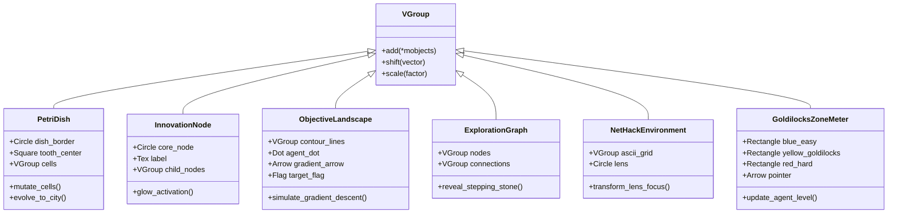
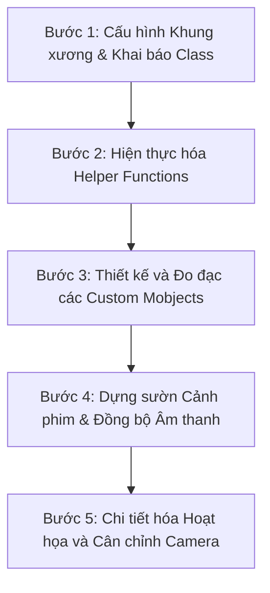

# Kiến trúc Mã nguồn: `open_endedness.py`

Tài liệu này đề xuất thiết kế kiến trúc mã nguồn và hệ thống hoạt họa hoàn chỉnh cho tệp [open_endedness.py](file:///d:/HCMUS/NH%202025-2026/HK2/Machine%20learning/Lab1/Open-Endedness-World-Models-and-the-Automation-of-Innovation/scenes/part_1_open_endedness/open_endedness.py) thuộc **Phần 1: Open-Endedness (Tính mở)**. Kiến trúc này được thiết kế nhằm kế thừa nguyên vẹn ngôn ngữ thiết kế, tư duy hình học, và phương pháp đồng bộ âm thanh đặc trưng từ [Genie.py](file:///d:/HCMUS/NH%202025-2026/HK2/Machine%20learning/Lab1/Open-Endedness-World-Models-and-the-Automation-of-Innovation/scenes/part_2_world_models/Genie.py).

---

## 1. Global Configuration (Cấu hình Toàn cục)

Để hiển thị tiếng Việt chính xác và đảm bảo chất lượng hình ảnh đồng bộ, cấu hình toàn cục sử dụng bộ biên dịch XeLaTeX cùng với bảng màu (color palette) và các hằng số bố cục thống nhất.

### 1.1. TexTemplate & Fonts
Sử dụng XeLaTeX làm bộ biên dịch thay vì LaTeX mặc định để kết xuất Unicode (tiếng Việt). Các gói bổ trợ cơ bản bao gồm `amsmath` cho các phương trình toán học và `xcolor` để xử lý màu trong LaTeX.

```python
from manim import *
import numpy as np
import os

# Cấu hình TexTemplate hỗ trợ tiếng Việt qua XeLaTeX
vietnamese_template = TexTemplate(tex_compiler="xelatex", output_format=".xdv")
vietnamese_template.add_to_preamble(r"\usepackage{xcolor}")
vietnamese_template.add_to_preamble(r"\usepackage{amsmath}")
config.tex_template = vietnamese_template
```

### 1.2. Colors (Bảng màu Biểu học)
Bảng màu tuân thủ nghiêm ngặt nguyên lý thiết kế của 3Blue1Brown và `Genie.py`. Màu sắc không chỉ mang tính thẩm mỹ mà còn đại diện cho các khái niệm kỹ thuật xuyên suốt:

| Tên Hằng số | Mã Màu Hex | Ý nghĩa Kỹ thuật / Vai trò |
| :--- | :--- | :--- |
| `WHITE` | `#FFFFFF` | Nội dung văn bản bình thường, các đường lưới biên. |
| `GOLD` | `#F0AC5F` | Tiêu đề chính, trích dẫn học thuật quan trọng, Goldilocks Zone. |
| `GOLD_E` | `#9B6A2F` | Màu nền rực rỡ, highlight mờ cho các vùng tối ưu. |
| `BLUE_C` | `#58C4DD` | Tác nhân thông minh (Agent), Sinh vật (Organism), Tokens. |
| `BLUE_E` | `#1C758A` | Màu nền khung của Tác nhân/Video Tokenizer. |
| `GREEN_C` | `#83C167` | Môi trường (Environment), Thế giới thực nghiệm. |
| `GREEN_E` | `#416832` | Màu nền hộp Môi trường/Hệ thống XLand. |
| `ORANGE` | `#FF862F` | Hành động (Action), Các toán tử tiến hóa (LLM, LAM). |
| `RED` | `#FC6255` | Lỗi hệ thống, Ranh giới đóng, Trạng thái quá khó (`Cross`). |
| `RED_E` | `#94231E` | Nền cảnh báo, Hộp kẹt phân khúc hẹp (Niche). |
| `GRAY_A` | `#C8C8C8` | Chú thích phụ, văn bản mô tả thuật toán. |
| `GRAY_E` | `#222222` | Các vùng bị sương mù tri thức che phủ, trạng thái chưa khám phá. |

### 1.3. Layout Constants (Hằng số Bố cục)
Màn hình Manim mặc định có kích thước $14.0 \times 8.0$ đơn vị (tọa độ từ $-7.0$ đến $+7.0$ theo chiều ngang, và $-4.0$ đến $+4.0$ theo chiều dọc).

```python
# Kích thước lưới màn hình an toàn
SCREEN_WIDTH = 14.0
SCREEN_HEIGHT = 8.0
SAFE_PADDING = 0.25

# Tọa độ phân vùng hiển thị cho bố cục 3 cột (SC_03)
COL3_LEFT = -4.5
COL3_CENTER = 0.0
COL3_RIGHT = 4.5
ROW_Y_TOP = 1.8
ROW_Y_MID = 0.0
ROW_Y_BOT = -1.8
```

### 1.4. Animation Timing Constants (Hằng số Thời gian Hoạt họa)
Tốc độ của các hiệu ứng chuyển đổi cần tuân thủ nhịp điệu kể chuyện giáo dục (Educational pacing), tránh hoạt họa quá nhanh làm người nghe không kịp xử lý thông tin:

```python
TIME_WRITE_FAST = 0.8     # Viết nhãn ngắn hoặc công thức phụ
TIME_WRITE_NORMAL = 1.5   # Viết tiêu đề hoặc câu trích dẫn dài
TIME_TRANSITION = 1.0     # Chuyển cảnh bằng FadeOut/FadeIn
TIME_POP_CARD = 1.2       # Tạo hộp và viết nội dung bên trong
TIME_HIGHLIGHT = 0.5      # Zoom nhấp nháy hoặc đổi màu viền
```

---

## 2. Base Scene Classes (Lớp Cảnh cơ bản)

Để phân tách trách nhiệm điều khiển camera và tự động hóa các thiết lập ban đầu, hệ thống định nghĩa hai lớp cảnh cha:

```python
class VietnameseScene(Scene):
    """
    Trách nhiệm:
    - Thiết lập TexTemplate hỗ trợ Unicode mặc định cho toàn cảnh.
    - Cấu hình nền tối (Pure Black) tăng tính tương phản cho hoạt họa.
    - Đóng vai trò là lớp cha cho các cảnh đồ thị tĩnh hoặc phẳng 2D.
    
    Khi nào dùng:
    - Các phân cảnh trình bày văn bản, trích dẫn, sơ đồ Venn, hoặc biểu đồ.
    - Ví dụ: SC_01, SC_03, SC_04, SC_06, SC_07.
    
    Khi nào không dùng:
    - Cần các hiệu ứng zoom cận cảnh vào một đối tượng con hoặc di chuyển sang các khu vực ngoài màn hình.
    """
    def setup(self):
        config.tex_template = vietnamese_template
        super().setup()

class VietnameseMovingCameraScene(MovingCameraScene):
    """
    Trách nhiệm:
    - Thiết lập XeLaTeX và hỗ trợ đầy đủ các thuộc tính của MovingCameraScene.
    - Hỗ trợ phóng to/thu nhỏ (zoom) và dịch chuyển camera (panning) mượt mà.
    
    Khi nào dùng:
    - Cảnh SC_02 (Zoom từ chiếc đĩa petri tổng quát vào đô thị tiến hóa công nghệ).
    - Cảnh SC_05 (Phóng to ký tự ASCII '@' trong NetHack để hiện thực hóa đồ họa tối giản; di chuyển camera qua các cột ma trận XLand).
    
    Khi nào không dùng:
    - Cảnh chỉ hiển thị bảng so sánh tĩnh hoặc các khối hộp cố định, để tiết kiệm tài nguyên render và tránh rung camera không chủ đích.
    """
    def setup(self):
        config.tex_template = vietnamese_template
        super().setup()
```

---

## 3. Helper Functions (Hàm Tiện ích)

Để tránh trùng lặp mã nguồn và đảm bảo tính đồng bộ của giao diện, 6 hàm tiện ích sau được thiết kế:

### 3.1. `fit_in_box`
Tự động căn chỉnh tỷ lệ và di chuyển đối tượng văn bản nằm gọn trong một khung an toàn.
* **Inputs:** `mobject` (Mobject cần co giãn), `box` (RoundedRectangle/Rectangle chứa), `padding` (Khoảng đệm an toàn).
* **Outputs:** `mobject` (Đã được scale và căn tâm).
* **Reusability:** Rất cao. Được dùng cho mọi nhãn văn bản nằm trong thẻ hộp (Agent, Environment, Task, Stepping Stones).

### 3.2. `load_safe_sound`
Tải tệp âm thanh WAV và in cảnh báo nếu không tìm thấy tệp thay vì làm gián đoạn tiến trình render.
* **Inputs:** `scene` (Cảnh hiện tại), `filename` (Tên file âm thanh).
* **Outputs:** None.
* **Reusability:** Cao. Gọi ở đầu hàm `construct` của mỗi Scene.

### 3.3. `create_title_banner`
Tạo một cụm tiêu đề chính ở góc trên màn hình kèm đường kẻ ngang phân tách.
* **Inputs:** `title_text` (Nội dung string LaTeX), `color` (Màu sắc tiêu đề).
* **Outputs:** `VGroup` chứa tiêu đề và đường kẻ.
* **Reusability:** Cao. Tạo cấu trúc tiêu đề chuẩn hóa cho 7 phân cảnh.

### 3.4. `create_concept_card`
Tạo một tấm card thông tin bo góc chứa tiêu đề phụ và danh sách gạch đầu dòng bên trong.
* **Inputs:** `title` (Tiêu đề card), `content_list` (Danh sách các dòng LaTeX), `border_color` (Màu viền), `width`, `height`.
* **Outputs:** `VGroup` (Khung card và văn bản đã được căn chỉnh).
* **Reusability:** Cao. Dùng để trình bày định nghĩa hoặc thông số kỹ thuật.

### 3.5. `create_section_transition`
Tạo hiệu ứng chuyển đổi giữa các Phase lớn bằng cách làm mờ màn hình và viết tiêu đề chuyển đoạn ở giữa.
* **Inputs:** `scene` (Cảnh hiện tại), `title_text` (Tiêu đề chuyển đoạn), `duration` (Thời gian dừng).
* **Outputs:** None (Trực tiếp thực hiện hiệu ứng).
* **Reusability:** Trung bình.

### 3.6. `create_comparison_table`
Dựng cấu trúc bảng so sánh tham số hóa tự động tính toán tọa độ lưới.
* **Inputs:** `headers` (Mảng tiêu đề cột), `rows` (Mảng 2 chiều chứa nội dung ô), `col_widths` (Độ rộng các cột), `row_heights` (Độ cao các hàng).
* **Outputs:** `VGroup` chứa các dòng kẻ và văn bản của bảng.
* **Reusability:** Trung bình.

---

## 4. Custom Mobjects (Đối tượng Hoạt họa Tùy chỉnh)

Các thực thể hình học phức tạp được đóng gói thành các Class kế thừa từ `VGroup`.



### 4.1. Class `PetriDish`
* **Purpose:** Trực quan hóa đĩa Petri tiến hóa của Lisa Simpson trong `SC_02`.
* **Components:** 
  - Một đường tròn biên (`Circle`, nét đứt hoặc mờ nhạt).
  - Một hình vuông ở giữa biểu thị chiếc răng sữa.
  - Các chấm tròn nhỏ phân tán biểu thị chất dinh dưỡng/cola.
* **Reuse Potential:** Sử dụng chính trong `SC_02` và có thể tái hiện dưới dạng sơ đồ thu nhỏ ở `SC_07` (Vòng lặp tiến hóa).

### 4.2. Class `InnovationNode`
* **Purpose:** Biểu thị các phát kiến hoặc kỹ năng mới phát sinh trong cấu trúc tiến hóa mở.
* **Components:** 
  - Vòng tròn trung tâm chứa biểu tượng hoặc chữ.
  - Các đường liên kết nhánh phát ra xung quanh.
  - Phương thức `glow_activation()` làm sáng viền bằng màu `GOLD` hoặc `ORANGE`.
* **Reuse Potential:** Rất cao. Sử dụng trong `SC_01` (Paradigm Shift), `SC_03` (Standish definition) và `SC_07` (Evolutionary loop).

### 4.3. Class `ObjectiveLandscape`
* **Purpose:** Biểu thị đồ thị lỗi/địa hình lồi lõm của hàm tối ưu hóa mục tiêu.
* **Components:**
  - Tập hợp các đường đồng mức lượn sóng (`ParametricFunction` hoặc tập hợp các đường cong bo góc khép kín đồng tâm).
  - Một Dot đại diện cho Agent di chuyển dọc theo vector Gradient.
  - Một lá cờ cắm trên đỉnh biểu thị mục tiêu tối hậu.
* **Reuse Potential:** Dùng trong `SC_04` (Sự sụp đổ của la bàn mục tiêu) và tái sử dụng ở `SC_06` để minh họa hiện tượng kẹt phân khúc hẹp (Niche).

### 4.4. Class `ExplorationGraph`
* **Purpose:** Biểu diễn các bước đệm tiến hóa phi tuyến tính (Stepping Stones).
* **Components:**
  - Các khối đa giác bo góc màu xám nhạt (`RoundedRectangle`) đóng vai trò các bước đệm.
  - Lớp sương mù tri thức (`GRAY_E` che phủ các vùng chưa đi tới).
  - Phương thức `reveal_stepping_stone()` thực hiện hiệu ứng tỏa sóng ánh sáng làm tan sương mù và hiện ra các nút kế tiếp.
* **Reuse Potential:** Sử dụng chính trong `SC_04`.

### 4.5. Class `NetHackEnvironment`
* **Purpose:** Biểu diễn lưới trò chơi NetHack và cơ chế dịch nghĩa ký tự ASCII trong `SC_05`.
* **Components:**
  - Lưới ký tự dạng văn bản (`Text` hoặc `MathTex`) chứa các ký hiệu như `@`, `d`, `D`, `k`, `.`.
  - Một kính lúp hoạt họa (`lens`, gồm vòng tròn màu vàng và tay cầm).
  - Phương thức `transform_lens_focus()` biến đổi ký tự ASCII nằm trong kính lúp thành các hình khối học phẳng tương ứng (Ví dụ: `@` biến thành Agent `BLUE_C`).
* **Reuse Potential:** Dùng cho phân cảnh NetHack của `SC_05`.

### 4.6. Class `GoldilocksZoneMeter`
* **Purpose:** Biểu diễn trục độ khó và khả năng tự cân bằng của giáo trình ở `SC_06`.
* **Components:**
  - Trực dọc chia làm 3 phân vùng màu: Dưới (Xanh dương - Quá dễ), Giữa (Vàng sáng - Goldilocks), Trên (Đỏ đậm - Quá khó).
  - Một con trỏ trượt chỉ vị trí năng lực hiện tại của tác nhân.
  - Phương thức `update_agent_level(new_level)` điều chỉnh vị trí con trỏ và thực hiện co giãn dải màu vàng Goldilocks tương ứng.
* **Reuse Potential:** Dùng trong `SC_06` (Khủng hoảng giáo trình) và `SC_07` (LLM Task Proposer chọn nhiệm vụ).

---

## 5. Scene Class Hierarchy (Hệ thống Cảnh phim)

Dưới đây là sơ đồ kế thừa và phân bố 7 lớp Scene tương ứng với 7 phân cảnh lớn trong kịch bản:

```
VietnameseScene (Lớp cảnh cha tĩnh)
 ├── SC_01_TheHorizonOfAGI
 ├── SC_03_DeconstructingOpenEndedSystems
 ├── SC_04_TheIllusionOfGoals
 ├── SC_06_TheAutocurriculaBottleneck
 └── SC_07_TheEvolutionaryEngines

VietnameseMovingCameraScene (Lớp cảnh cha động)
 ├── SC_02_TheMetaphorOfThePetriDish
 └── SC_05_TheConcretePlaygrounds
```

### Chi tiết các Scene Class:

#### 1. `SC_01_TheHorizonOfAGI`
* **Parent Class:** `VietnameseScene`
* **Estimated Duration:** 150 giây (2.5 phút).
* **Major Concepts:** Bão hòa dữ liệu tĩnh, Kỷ nguyên Trải nghiệm (Sutton & Silver), Mối quan hệ tương hỗ sinh vật - môi trường (Alan Watts).
* **Camera Requirement:** Camera tĩnh 2D. Tập trung vào việc chuyển đổi giữa khối hộp dữ liệu tĩnh và trục thời gian trải nghiệm năng động.

#### 2. `SC_02_TheMetaphorOfThePetriDish`
* **Parent Class:** `VietnameseMovingCameraScene`
* **Estimated Duration:** 120 giây (2.0 phút).
* **Major Concepts:** Chiếc răng sữa trong Coca-Cola (Genesis Tub), tiến hóa sinh học sang tiến hóa văn hóa/công nghệ, sự khác biệt giữa hệ thống đóng (cờ Vây) và hệ thống mở.
* **Camera Requirement:** Camera động. Cần phóng to cận cảnh vào một phân khu của đĩa Petri khi nó biến chuyển thành đô thị công nghệ rực sáng màu `GOLD`.

#### 3. `SC_03_DeconstructingOpenEndedSystems`
* **Parent Class:** `VietnameseScene`
* **Estimated Duration:** 180 giây (3.0 phút).
* **Major Concepts:** Định nghĩa Standish (Lăng kính quan sát viên), Nghịch lý TV nhiễu hạt, Sự kết hợp của tính mới (Novelty) và tính học được (Learnability) qua sơ đồ tập hợp Venn.
* **Camera Requirement:** Bố cục phẳng chia 3 cột cố định. Không dịch chuyển camera để người xem dễ dàng đối chiếu trực quan 3 loại hệ thống.

#### 4. `SC_04_TheIllusionOfGoals`
* **Parent Class:** `VietnameseScene`
* **Estimated Duration:** 180 giây (3.0 phút).
* **Major Concepts:** Thiết kế dựa trên mục tiêu cố định (Objective Design) là chiếc la bàn giả, Lý thuyết bước đệm (Stepping Stones) phi tuyến tính, Bản đồ địa hình lồi lõm chứa hố kẹt cục bộ.
* **Camera Requirement:** Camera tĩnh, tận dụng phép biến hình đối tượng (`Transform`) và sự chuyển động phi tuyến tính của Agent trên sơ đồ lưới.

#### 5. `SC_05_TheConcretePlaygrounds`
* **Parent Class:** `VietnameseMovingCameraScene`
* **Estimated Duration:** 210 giây (3.5 phút).
* **Major Concepts:** Không gian Turing-complete, logic NetHack ASCII, Tạo sinh thủ tục (Procedural Generation) trong XLand qua phép nhân tổ hợp ma trận tham số (Địa hình x Vật thể x Luật chơi).
* **Camera Requirement:** Camera động. Phóng to kính lúp vào ký tự ASCII của NetHack và panning quét qua cấu trúc ma trận tham số để minh họa 25 tỷ nhiệm vụ của XLand.

#### 6. `SC_06_TheAutocurriculaBottleneck`
* **Parent Class:** `VietnameseScene`
* **Estimated Duration:** 180 giây (3.0 phút).
* **Major Concepts:** Sự sụp đổ của cơ chế tự đối đầu (Self-Play), Hiện tượng kẹt phân khúc hẹp (Niche Entrapment), Trục độ khó nhận thức và Vùng Goldilocks.
* **Camera Requirement:** Camera tĩnh. Tập trung diễn họa dòng chảy của chấm tròn Agent bị kẹt trong vòng lặp đóng và sự đứt gãy của dải màu Goldilocks trên trục đứng.

#### 7. `SC_07_TheEvolutionaryEngines`
* **Parent Class:** `VietnameseScene`
* **Estimated Duration:** 180 giây (3.0 phút).
* **Major Concepts:** LLM Task Proposer làm Toán tử Biến dị & Chọn lọc ngữ nghĩa, Bằng chứng thực nghiệm (Đồ thị hiệu suất mẫu dốc đứng), Cảnh báo an toàn AI (Specification Gaming).
* **Camera Requirement:** Camera tĩnh. Bố cục cân đối giữa Vòng lặp tiến hóa LLM - Môi trường ở phía trên và hai đường đồ thị đối chiếu hiệu năng ở góc dưới.

---

## 6. Asset Strategy (Chiến lược Quản lý Tài nguyên)

Hệ thống thư mục tài nguyên của Part 1 được tổ chức cô lập trong thư mục `assets/` cục bộ:

```
scenes/part_1_open_endedness/
 ├── open_endedness.py
 └── assets/
      ├── audio/
      │    ├── SC_01_ParadigmShift.wav
      │    ├── SC_02_PetriDish.wav
      │    ├── SC_03_ObserverVenn.wav
      │    ├── SC_04_SteppingStones.wav
      │    ├── SC_05_NetHackXLand.wav
      │    ├── SC_06_GoldilocksNiche.wav
      │    └── SC_07_EvolutionOperators.wav
      ├── images/
      │    ├── SC_05_NetHackIntro.png   (Màn hình thô của game NetHack)
      │    └── SC_07_PerformanceGraph.png (Biểu đồ gốc từ bài talk)
      ├── svg/
      │    └── SC_02_SimpsonTooth.svg   (SVG răng sữa tối giản)
      └── icons/
           ├── icon_agent.svg
           ├── icon_environment.svg
           └── icon_controller.svg
```

### Quy tắc đặt tên (Naming Conventions):
* **Âm thanh:** Mẫu đặt tên bắt buộc là `SC_XX_<Tên_Mô_Tả>.wav` tương ứng với mã số phân cảnh để phục vụ đồng bộ hóa.
* **Hình ảnh & SVG:** Sử dụng định dạng chữ thường ngăn cách bởi dấu gạch dưới, bắt đầu bằng mã phân cảnh, ví dụ: `SC_05_nethack_grid.png`.

---

## 7. Voice Synchronization Strategy (Đồng bộ Hóa Giọng đọc)

Để ngăn chặn tuyệt đối hiện tượng lệch pha giữa hoạt ảnh và âm thanh (Audio-Video Drift), kiến trúc triển khai áp dụng 4 nguyên tắc đồng bộ hóa cơ học sau:

### 7.1. Định dạng Tải Âm thanh Cục bộ
Không sử dụng đường dẫn tuyệt đối. Sử dụng module `os` để tải tệp âm thanh tương đối dựa trên vị trí của file mã nguồn:

```python
# Gọi ở đầu phương thức construct() của mỗi lớp Scene
audio_path = os.path.join(os.path.dirname(__file__), "assets", "audio", "SC_01_ParadigmShift.wav")
self.add_sound(audio_path)
```

### 7.2. Kiểm soát Dòng thời gian bằng Mốc thời gian Tuyệt đối (Absolute Timeline Anchors)
Bên trong hàm `construct()`, toàn bộ mã nguồn được phân rã thành các khối comment đại diện cho các Phase âm thanh cụ thể. Mọi thời điểm hoạt họa phải được ghi rõ trong comment dưới dạng `Thời gian bắt đầu (giây) -> Thời gian kết thúc (giây)`.

### 7.3. Thuật toán Tính toán Thời gian Chờ (`self.wait`)
Tuyệt đối không sử dụng hàm `self.wait(1.0)` hay `self.wait(2.0)` một cách ngẫu nhiên. Sau mỗi hiệu ứng play, lập trình viên phải ghi nhận thời gian chạy của hoạt họa (`run_time`) và tính toán lượng thời gian chờ chính xác để chạm tới mốc neo tiếp theo của âm thanh:

$$\text{Wait Duration} = \text{Target Timestamp} - \text{Cumulative Elapsed Time}$$

```python
# Ví dụ tính toán đồng bộ cho SC_01:
# Mốc 0s: Bắt đầu phát âm thanh
self.wait(0.5) # Chờ 0.5 giây đầu trước khi viết câu hỏi

# Mốc 0.5s: Viết câu hỏi (Chạy trong 1.5 giây -> kết thúc ở 2.0s)
self.play(Write(question), run_time=1.5)

# Mốc cần neo tiếp theo: 3.0s (Show Agent Option)
# Đã trôi qua: 0.5s (chờ) + 1.5s (chạy) = 2.0s
# Thời gian cần wait thêm: 3.0s - 2.0s = 1.0s
self.wait(1.0)

# Mốc 3.0s: Tạo hộp Agent (Chạy trong 1.0 giây -> kết thúc ở 4.0s)
self.play(Create(agent_box), run_time=1.0)
```

---

## 8. Render Strategy (Chiến lược Render và Kiểm thử)

Quy trình biên dịch video được thực hiện theo cấu trúc 3 lớp nhằm tối ưu hóa tài nguyên tính toán và thời gian của nhà phát triển:

### 8.1. Thứ tự Render đề xuất
1. **Kiểm tra cú pháp (Linting):** Chạy kiểm tra Python và LaTeX độc lập để phát hiện lỗi gõ công thức hoặc nhập thư viện trước khi biên dịch đồ họa.
2. **Render kiểm thử cảnh đơn (Draft Scene Render):** Render từng phân cảnh riêng lẻ ở độ phân giải thấp.
3. **Render kiểm thử tích hợp (Low-Res Full Render):** Ghép toàn bộ các cảnh để kiểm tra dòng âm thanh chạy xuyên suốt.
4. **Render chất lượng cao cuối cùng (Final High-Res Render):** Biên dịch bản phát hành cuối cùng.

### 8.2. Hệ thống Câu lệnh kiểm thử (Test Commands)
Để tối ưu tốc độ, sử dụng tham số `-ql` (Low Quality - 480p, 15fps) để kiểm tra luồng hoạt họa nhanh, `-qm` (Medium Quality - 720p, 30fps) để kiểm tra độ mịn chuyển động và `-qh` (High Quality - 1080p, 60fps) cho bản xuất bản cuối cùng.

* **Lưu ý:** Thư mục thực thi lệnh luôn nằm tại gốc workspace.

```powershell
# 1. Render kiểm thử nhanh SC_01 ở chất lượng 480p (Rất nhanh):
manim -ql scenes/part_1_open_endedness/open_endedness.py SC_01_TheHorizonOfAGI

# 2. Render kiểm thử camera động SC_05 ở chất lượng 720p:
manim -qm scenes/part_1_open_endedness/open_endedness.py SC_05_TheConcretePlaygrounds

# 3. Render toàn bộ file open_endedness.py ở chất lượng cao nhất 1080p:
manim -qh scenes/part_1_open_endedness/open_endedness.py
```

---

## 9. Coding Roadmap (Lộ trình Triển khai)

Để giảm thiểu tối đa rủi ro phải viết lại mã nguồn (refactoring) và đảm bảo tính nhất quán của hệ thống, quy trình triển khai được chia làm 5 bước tuần tự:



### Chi tiết các bước thực hiện:

#### Bước 1: Cấu hình Khung xương & Khai báo Class
* Khai báo tệp [open_endedness.py](file:///d:/HCMUS/NH%202025-2026/HK2/Machine%20learning/Lab1/Open-Endedness-World-Models-and-the-Automation-of-Innovation/scenes/part_1_open_endedness/open_endedness.py).
* Thiết lập hằng số màu sắc, `vietnamese_template` và hai lớp cảnh cha `VietnameseScene`, `VietnameseMovingCameraScene`.
* Khai báo các class Scene từ `SC_01` đến `SC_07` nhưng chỉ để phương thức `construct()` chứa lệnh `pass`.

#### Bước 2: Hiện thực hóa Helper Functions
* Viết code hoàn chỉnh cho 6 hàm tiện ích: `fit_in_box()`, `load_safe_sound()`, `create_title_banner()`, `create_concept_card()`, `create_section_transition()`, `create_comparison_table()`.
* Viết một file test nhỏ trong thư mục `scratch/` để kiểm tra độ co giãn an toàn của hàm `fit_in_box` đối với các đoạn văn bản dài tiếng Việt.

#### Bước 3: Thiết kế và Đo đạc các Custom Mobjects
* Triển khai cấu trúc hình học của các lớp Mobjects tùy chỉnh (`PetriDish`, `ObjectiveLandscape`, `NetHackEnvironment`, `GoldilocksZoneMeter`).
* Thiết lập các thuộc tính kích thước, màu sắc và độ dày đường nét để đảm bảo khi khởi tạo, chúng tự động hiển thị cân đối trên màn hình 2D mà không cần truyền quá nhiều tham số vị trí thủ công.

#### Bước 4: Dựng sườn Cảnh phim & Đồng bộ Âm thanh
* Đưa mã lệnh tải âm thanh `self.add_sound()` vào đầu mỗi Scene.
* Chia phương thức `construct()` thành các khối logic comment tương ứng với các phân đoạn giây trong kịch bản thoại.
* Điền đầy đủ các lệnh `self.wait(duration)` tương ứng để thiết lập một hệ thống khung thời gian (Time Skeleton) rỗng nhưng có độ dài khớp hoàn hảo với các file âm thanh.

#### Bước 5: Chi tiết hóa Hoạt họa và Cân chỉnh Camera
* Triển khai chi tiết mã nguồn hoạt họa bên trong từng Phase của các Scene.
* Thay thế các lệnh `pass` hoặc `self.wait` tạm thời bằng các hàm vẽ hình học (`Create`, `Write`, `Transform`, `FadeIn`, `FadeOut`).
* Cuối cùng, thực hiện căn chỉnh camera động trong `SC_02` và `SC_05` bằng cách gọi lệnh di chuyển camera (`self.camera.frame.animate.shift(...)`) khớp với các mốc thời gian thoại quan trọng.
* Thực hiện chạy thử nghiệm render độ phân giải thấp và tinh chỉnh độ lệch mili-giây nếu có.
